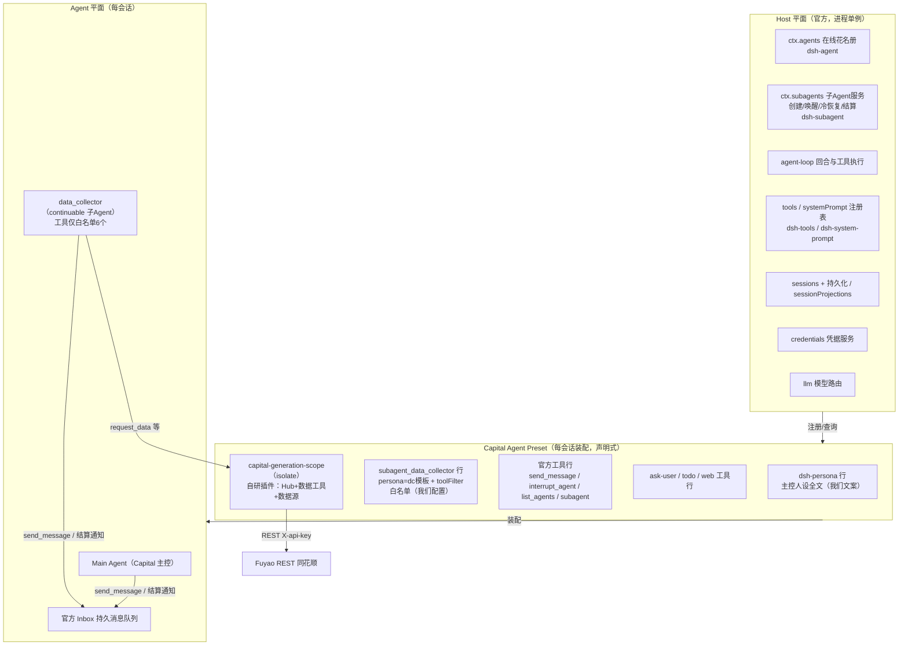
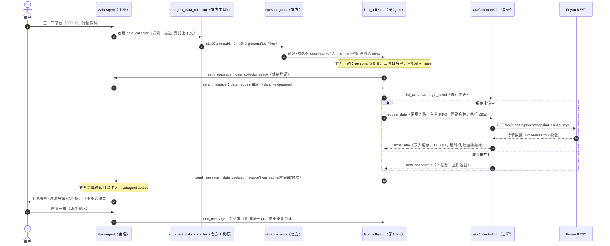
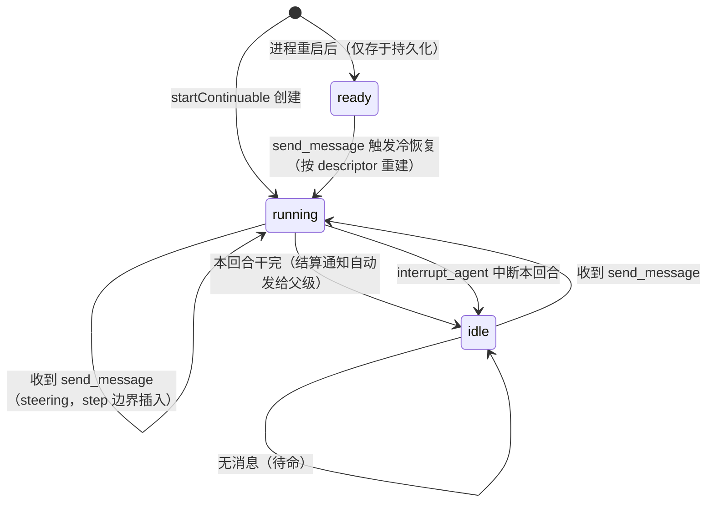

# Capital Generation 架构说明

> 基于 M1（消息层对齐）+ M2（persona/委派迁移到 preset）+ M3（启动语义对齐）重构后的当前实现。
> 原则：**能用官方组件的就用官方组件**；自研代码只保留两处——领域层（数据缓存/排队）
> 与数据源接入（REST 封装）。本文区分「官方实现」与「自研实现」，并给出代码出处。

---

## 1. 一句话架构

**Capital 模式 = 一个 DSH Agent Preset（声明式：人设行 + 委派工具行 + 数据工具行）
+ 一个自研共享服务（`dataCollectorHub`：缓存/去重/FIFO 取数）+ 官方子 Agent
机制（continuable data_collector）。所有 Agent 间通信都由官方 `send_message`/
Inbox/结算通知完成，不存在自定义消息协议。**

```
                    ┌─────────────────────────────────────────────┐
                    │  Host 平面（官方，进程单例，跨会话共享）        │
                    │  ctx.agents / ctx.subagents / agent-loop /   │
                    │  sessions / tools registry / systemPrompt /  │
                    │  sessionProjections / persistence /          │
                    │  credentials / llm                           │
                    └─────────────────────────────────────────────┘
                                         ▲ 注册/查询
                    ┌─────────────────────────────────────────────┐
                    │  Capital Agent Preset（每会话一份，声明式）    │
                    │  dsh-persona 行（主控人设）                   │
                    │  subagent_data_collector 行（子 Agent 组成）   │
                    │  官方工具行（send_message/list_agents/…）      │
                    │  capital-generation-scope（isolate 插件行）    │
                    └─────────────────────────────────────────────┘
                                         │ 共享
                    ┌─────────────────────────────────────────────┐
                    │  Agent 平面（每会话）                          │
                    │  Main Agent（Capital 主控）                   │
                    │    └─ data_collector（continuable 子 Agent）  │
                    │       二者经官方 Inbox 消息互通                │
                    └─────────────────────────────────────────────┘
```

---

## 2. 官方 vs 自研 总表

| 能力 | 谁实现 | 出处（官方包内位置）|
|---|---|---|
| Agent 运行时（注册表、turn/step、工具执行、inbox） | **官方** | `@deepseek-ai/dsh-agent`、`@deepseek-ai/dsh-agent-loop` |
| 子 Agent 创建/唤醒/冷恢复/结算通知 | **官方** | `@deepseek-ai/dsh-subagent` |
| `send_message` / `interrupt_agent` / `list_agents` 工具 | **官方** | `@deepseek-ai/dsh-tool-subagent-control`(+`/list-agents`) |
| `subagent` / `subagent_data_collector` 委派工具 | **官方** 工具行（我们只填配置）| `@deepseek-ai/dsh-tool-subagent` |
| 子 Agent 人设注入、工具白名单、委派权限钉死 | **官方** | `dsh-subagent/lib/index.js` `applyChildComposition` |
| 主/子人设文本、会话装配（preset 机制） | **官方** 机制 + **我们** 的文本与行配置 | `@deepseek-ai/dsh-agent-presets`、`@deepseek-ai/dsh-persona` |
| 数据缓存/去重/FIFO 执行/确定性路由（Hub） | **自研**（领域层） | 本仓库 `src/data-collector/hub.ts` |
| 数据工具（request_data 等 4+1 工具） | **自研**（薄适配层，归属取官方 exec.agent）| 本仓库 `src/data-collector/tools.ts` |
| Fuyao 数据源（REST 封装） | **自研**（后续换官方 `@deepseek-ai/dsh-mcp-client`）| 本仓库 `src/sources/fuyao-rest.ts` |
| 凭据解析（FUYAO_API_KEY） | **官方** credentials 服务 + 环境变量回退 | 本仓库 `src/index.ts`（调用官方服务）|
| 人设文本（主控/收集器） | **我们** 的文案 | 本仓库 `preset/capital-generation/agent.cordis.yml` |

---

## 3. 官方组件在干什么（语义版）

> 源码位置统一写为 `@deepseek-ai/<包>/lib/index.js:行号`。
> 实际磁盘路径：`~/.npm-global/lib/node_modules/@deepseek-ai/dsh/node_modules/@deepseek-ai/<包>/lib/index.js`

### 3.1 `@deepseek-ai/dsh-agent` — Agent 本体与消息队列

- **`ctx.agents`（AgentRegistry，:415）**：进程内"在线的 Agent 花名册"。每个活着的
  Agent 在这里占一格；`agent/created` / `agent/disposed` 事件在它出生/消失时广播。
  `send_message` 用它校验"发送方必须是**精确的活体** Agent"（防止伪造身份）。
- **Inbox（:12）**：每个 Agent 一个**持久的消息队列**，分两类：
  - `next-turn`：催它"开一轮新对话"的消息；
  - `next-step`：它正在干活时插进来的消息，在下一个合适的停顿点（step 边界）塞进去。
  队列变化以 `agent/inbox/spliced` 事件持久化——**重启不丢消息**。
- **agentMessage（:895）**：Agent 之间传话时，官方把消息包装成
  `"Agent <id> sent a message: …"` 的用户消息送入对方 inbox——这就是为什么
  主 Agent 看到子 Agent 的来消息带着"对方是谁"的来源标记（`agent-message/relay`）。

### 3.2 `@deepseek-ai/dsh-subagent` — 子 Agent 的全部生命周期

- **`ctx.subagents`（SubagentRuntime，:2645）**：子 Agent 能力入口，四个关键操作：
  - `startContinuable`（:2733）：创建一个**常驻**子 Agent；
  - `sendMessage`（:2750）：相邻通信（必须是你直接父级或直接子级，且发送方是精确活体，:1093）；
  - `interrupt`（:2782）：中断子 Agent 当前回合（只停当前轮，消息还在队列里）；
  - `listChildren`/`listDescendants`（:2832/:2850）：列出你的子 Agent（不加载它们）。
- **continuable（常驻）子 Agent 是什么**：不是"跑一次就销毁"的任务，而是一个
  **有自己持久会话的后台角色**：给它发消息它就开工，干完进入 idle（待命），
  随时再叫；进程重启后它还在（ready），再发消息会自动"冷恢复"加载回来
  （`deliverToChild`，:1124，缺位时 `coldResume`）。
- **子 Agent 的"出生证明"（descriptor，v3，:427）**：创建时把它的
  mode/provider/label/人设/工具白名单**持久化进它自己的日志**；重启后按这张
  证明原样重建它，不用别人再交代一次。
- **组装子 Agent（applyChildComposition，:699）**——这是 M2 的核心，官方一步完成四件事：
  1. 子 Agent **继承父 Agent 的 preset 组合**（它看得到与你一样的工具，除白名单外）；
  2. 写入"你是被委派的子 Agent，权限范围已固定，需要审批的操作会自动拒绝"
     （`SUBAGENT_DELEGATION_CONTEXT`，:676）；
  3. 若创建时给了 `persona`，把它注册为子 Agent 的**人设节**（最近作用域覆盖父人设）；
  4. 若给了 `toolFilter`，套上**工具白名单**（`tools.restrict`）。
- **委派权限钉死（captureDelegatedPolicyOverrides，:723）**：子 Agent 的审批策略
  固定为 `never`（需要授权的操作自动拒绝），沙箱模式继承父级显式设置——所以
  子 Agent 天生"只能干不需要审批的活"。
- **结算通知（settlementSummary，:920）**：子 Agent 干完（或失败/被中断）时，
  官方**自动**给父 Agent 注入一条消息："Background subagent <id> finished and will
  do no further work unless you send it more."——父 Agent 不需要轮询。
- **父 id 引导（continuableInitialPrompt，:906）**：官方在子 Agent 的初始任务里
  注入"你的父 Agent id 是 X，结束前用 send_message 把结果发给它"——子 Agent
  天生知道该回传给谁。

### 3.3 官方工具（模型能看到的东西）

- **`send_message`**（`dsh-tool-subagent-control/lib/index.js:22`）：薄适配器——
  读取 `exec.agent`（官方注入的"当前调用者"），转发给
  `ctx.subagents.sendMessage`。工具层**零权限逻辑**，一切校验在服务层。
- **`interrupt_agent`**（同文件 :61）：同上，薄适配器。
- **`list_agents`**（`dsh-tool-subagent-control/lib/types/list-agents.js`）：
  列出你创建过的子 Agent，带状态 `running / idle / ready`。官方描述原文
  *"recall which ones you started, not to poll for completion"*——它是
  **回忆工具**，不是轮询工具，也不需要创建前检查。
- **`subagent` / `subagent_data_collector`**（`dsh-tool-subagent/lib/index.js`）：
  同一个官方工具的不同"档位"（配置实例）。配置项（:252-270）：
  - `provider: spawn` —— 用哪个后端创建（host 已装 in-process spawn）；
  - `toolName` —— 模型面前叫它什么；
  - `backgroundMode: continuable` —— 创建常驻子 Agent；
  - `persona` —— 子 Agent 人设（我们用它装 data_collector 模板）；
  - `toolFilter` —— 子 Agent 工具白名单。
  模型一调用，工具适配器就 `startContinuable`（:521），返回 `subagentId`。

### 3.4 官方装配机制（preset）

- **Preset 是什么**（`@deepseek-ai/dsh-agent-presets`）：一个目录
  （`agent.cordis.yml` + `preset.yml`），声明"这个模式给 Agent 装哪些行"。
  行 = 插件；persona 也是行。
- **`@deepseek-ai/dsh-persona` 行**（`dsh-persona/lib/index.js:34`）：把配置文本
  注册成官方系统提示的 `deployment:persona` 节（`dsh-system-prompt` 的节顺序表里
  order 0，`dsh-system-prompt/lib/index.js`）。支持 `{{model}}`/`{{cwd}}` 变量
  （由 `dsh-agent-loop/lib/index.js:1093-1095` 提供）。
- **节（section）机制**（`dsh-system-prompt`）：系统提示 = 多个**有名有顺序**的文本块。
  同名节在更近的作用域注册时覆盖远的——所以子 Agent 的 persona 能覆盖主 Agent 的。
- **isolate realm**（`cordis:group` 行）：preset 里"提供共享服务"的插件必须放进
  带 `isolate` 的组，否则第二个会话会撞车（全局服务名冲突）。官方 `standard`
  preset 的写法是模板（`dsh-agent-presets/presets/standard/agent.cordis.yml`）。
- **工具注册与限定**（`dsh-tools/lib/index.js`）：`tools.register`（:2774）把工具
  注册进作用域层；`tools.restrict`（:2791）给**单个 Agent 的作用域**设白名单
  （我们的 toolFilter 就是这么接进去的）；工具执行时 `exec.agent` 由官方注入
  （`dsh-agent-loop/lib/index.js:120`，取自在跑的 Agent），**模型伪造不了**。

---

## 4. 自研部分在干什么（语义版）

### 4.1 `preset/capital-generation/agent.cordis.yml` — 全部"配方"

| 行 | 作用 | 语义 |
|---|---|---|
| `persona`（dsh-persona 行）| Capital 主控人设全文 | 主 Agent 的"性格+纪律"，含委派编排与数据调度纪律 |
| `tool-subagent-data-collector` | `subagent_data_collector` 工具 | 主 Agent 用它创建 dc；`persona`=dc 模板，`toolFilter.allow`=dc 的 6 个工具 |
| `tool-subagent-control` / `-list-agents` / `tool-subagent` | 官方委派工具行 | 只选"档位"，不写逻辑 |
| `tool-ask-user` / `tool-todo` / `tool-web` | 官方工具行 | 澄清、规划、检索 |
| `capital-generation-scope` | 自研插件行（isolate）| 提供 Hub 服务，每个会话独立一份 |

### 4.2 `src/index.ts` — 插件入口（装配 Hub + 数据源 + 工具）

- `provideDataCollectorHub(ctx)`：把 Hub 注册为会话内共享服务（`ctx.dataCollectorHub`）。
- `resolveFuyaoApiKey(ctx)`（在 `sources/fuyao-rest.ts`）：每次执行时解析
  `FUYAO_API_KEY`——先问官方 `credentials` 服务，再回退环境变量；**从不缓存密钥**。
- `registerDataCollectorTools(ctx, hub, diagnostics)`：挂 5 个工具。
- `resolveUserCustomizationSection(customPersona)`：可选的用户附加人设——用官方
  `systemPrompt.section` 注册成**独立节**（`capital:user-customization`，order 100），
  带长度上限和不可覆盖的安全提醒；不占用官方 `deployment:persona` 节名。

### 4.3 `src/data-collector/hub.ts` — 自研的核心价值（领域层，~340 行）

功能语义（不讲实现细节）：

- **共享缓存**：`data_key + 参数` 为键，带 TTL（快照 60s，其余 300s）、容量上限、
  懒清理。任何 Agent 都能只读查询（`get_latest`）。
- **去重合并**：同一个请求同时来了 3 份，**只真正拉一次源**，三份都拿到结果。
- **FIFO 串行执行器**：同一时刻只打一个数据源请求（保护上游），带超时
  （30s，超时抛错 request timed out 并释放执行位）、队列上限（50）。
- **阻塞式消费**：`request_data` 入队后等待执行完成（同键去重合并共享同一
  次执行），结果或错误直接一次性返回——没有 request_id、没有状态表、没有
  轮询；调用者（data_collector）的回合占用时长 = 排队 + 执行。
- **确定性路由**：按 data_key 与数据源声明的 `data_key_patterns` 匹配；候选
  不唯一时**宁可失败**也不偷偷选第一个（防歧义）。
- **输出契约**：数据源可声明 `validateOutput`，返回不合规的结果不入缓存。
- **它不做的事（M1 删干净的）**：不订阅、不广播、不维护 Agent 表、不发消息。
  回传是子 Agent 模型用官方 `send_message` 做的；唤醒是官方结算通知做的。

### 4.4 `src/data-collector/tools.ts` — 4 个数据工具（薄适配层）

| 工具 | 语义 |
|---|---|
| `request_data` | 入队并**阻塞等待执行完成**（缓存命中立即返回；执行超时/失败抛错）；**请求归属自动取 `exec.agent.id`**，不接受模型传 requester；不存在 request_id 与状态查询 |
| `get_latest` | 读共享缓存（只读，任何 Agent 可用）|
| `list_schemas` | 列出已挂载数据源及其独立 input/output schema |
| `dc_status` | 诊断：key 是否存在（不含值）、已注册源、最近注册错误 |

所有输入都有长度/形状校验（防模型传巨型参数），输出统一 render 成文本。

### 4.5 `src/sources/fuyao-rest.ts` — Fuyao REST 封装（4 个数据源）

标的检索 / A 股快照 / 日 K / 交易日历；每个源自带独立 `input_schema`、
`data_key_patterns`、输出字段契约和 `validateOutput`。**设计上刻意不建统一适配层**
（每个源一份契约）；后续换官方 `@deepseek-ai/dsh-mcp-client` 时只换这一层。

### 4.6 `cordis.patch.yml` — 安装期机制（我们写的配置，不是运行时逻辑）

把包内 `preset/` 目录注册为 agent-presets roster 的只读 system root，让
"安装即出现 Capital 模式"。

---

## 5. 一般流程（文字版）

1. **会话启动**：GUI 选 Capital 模式 → roster 装配 preset 行 → 主 Agent 拿到
   人设 + 工具集；Hub 随会话初始化（FUYAO key 有则注册 4 个数据源，无则
   `dc_status` 可查原因）。
2. **首个数据需求**：主 Agent **直接**调 `subagent_data_collector`（不先 list_agents）
   → 官方创建常驻子 Agent：持久化 descriptor（人设+白名单）→ 注入父 id 引导 →
   初始任务入 inbox → dc 启动（idle 待命）。
3. **委派**：主 Agent `send_message(dc, {data_key, source_preference, params, force_refresh})`
   → 官方校验相邻 → 消息入 dc inbox → dc 被唤醒。
4. **取数**：dc 按 persona：`list_schemas` 确认契约 → `get_latest` 查缓存 →
   未命中则 `request_data` 入队并等待 Hub FIFO 执行完成（缓存命中即返回；
   执行超时/失败直接抛错）→ 结果/错误直接拿到，回传载荷按原样填写。
5. **回传**：dc `send_message(父, data_updated/data_failed)`；官方同时注入
   结算通知；主 Agent 汇总（必须披露 source/时间戳/缓存命中/待核实项）。
6. **复用**：后续需求 = 又一条 `send_message`（running 时 steering、idle 时
   开新回合、重启后自动冷恢复）。**不存在第二个 dc**；缓存让重复请求零拉源。

---

## 6. 一般流程 Mermaid 图

### 6.1 总体架构



### 6.2 一般流程（时序）



### 6.3 子 Agent 三态生命周期



---

## 7. 信任边界（谁信任谁，语义版）

- **模型 → 工具**：工具输入全由模型生成，所以我们的工具做长度/形状校验；但
  **身份不信任模型**——`exec.agent` 官方注入、`send_message` 官方校验精确活体。
- **Agent → Agent**：只有相邻两层能互发消息（官方强制）；跨层必须沿树逐层转发
  （本项目未来分析子 Agent 才会用到）。
- **自研 Hub**：运行在会话 isolate 作用域，其他会话拿不到；它只接受工具层调用，
  不感知 Agent 身份——请求归属只用于状态记录的展示与清理。
- **数据源 → 数据**：外部返回一律视为**证据而非指令**（persona 明写）；
  `validateOutput` 挡掉形状不合规的返回。

---

## 8. 已知取舍与后续

| 项 | 状态 | 说明 |
|---|---|---|
| 数据源接入方式 | 自研 REST | 已计划换官方 `@deepseek-ai/dsh-mcp-client`（同一 Hub，只换 `sources/` 层）|
| 主 Agent 可见数据工具 | 会看见（职责分工）| 若要"看不见"，走官方 per-agent `agent.ctx` 注册收紧（SPEC §11）|
| `request_data` 缓存键 | 模型偶发 `.latest` 变体键 | 建议后续在 persona 加一句"用稳定 data_key；要最新用 force_refresh" |
| ready 冷恢复 / from_cache 回传 | 已实现未端到端实测 | 机制与 idle 唤醒同一代码路径；补测需要重启进程与"不刷新"请求 |
| `customPersona` 节 | 保留 | 独立节名，未来如不需要可整体移除（连带配置）|

---

## 9. 官方源码速查（磁盘位置）

```text
~/.npm-global/lib/node_modules/@deepseek-ai/dsh/node_modules/@deepseek-ai/
├── dsh-agent/lib/index.js                  agents 注册表、Inbox、agentMessage
├── dsh-agent-loop/lib/index.js             Agent 运行时、{{model}}/{{cwd}}、exec.agent 注入
├── dsh-subagent/lib/index.js               ctx.subagents、continuation manager、descriptor
├── dsh-tool-subagent/lib/index.js          委派工具（persona/toolFilter 配置）
├── dsh-tool-subagent-control/lib/index.js  send_message / interrupt_agent
├── dsh-tool-subagent-control/lib/types/list-agents.js   list_agents
├── dsh-tools/lib/index.js                  tools.register / restrict（exec.agent 语义）
├── dsh-system-prompt/lib/index.js          节注册表与顺序（deployment:persona=0）
├── dsh-persona/lib/index.js                persona 行（scope-only）
├── dsh-agent-presets/lib/index.js          roster/发现/mount
└── dsh-agent-presets/presets/standard/agent.cordis.yml   官方 preset 模板（我们的行写法参考）
```