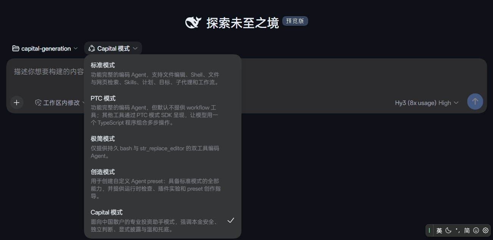
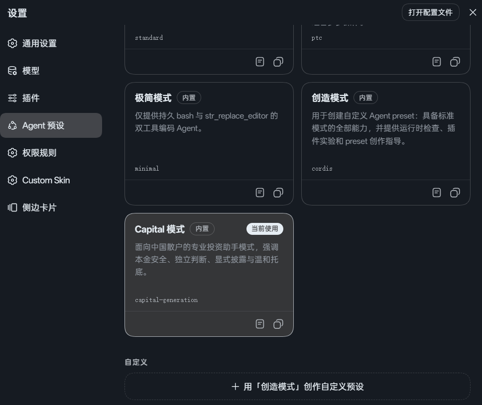

<p align="center">
  
</p>

<h1 align="center">Capital Generation</h1>

<p align="center">
  
</p>

<p align="center">
  <a href="https://github.com/deepseek-ai"></a>
  <a href="https://github.com/deepseek-ai"></a>
  <a href="https://github.com/v587d/capital-generation"></a>
  <a href="https://awesome-dsh-plugin.com"></a>
</p>

<p align="center">
  <a href="LICENSE"></a>
  <a href="https://github.com/v587d/capital-generation/releases"></a>
</p>

> [!IMPORTANT]
> 愿大家的财富数字就像"text generation"一样，不断增长，永不停止。

> [!NOTE]
> 已适配 Deepseek Harness@0.1.5-rc.1 

# Slogan
Next-Gen AI-Driven Capital Generation.

# What
Capital Generation 是面向中国散户，适用于日常证券研究的 DSH 插件，包括：
1. Agent preset（人设）： Capital 模式，与 DSH 默认四种模式并列。

2. 所有 Agent，包括主 Agent 均不能直接接触原始数据（行情、财务报表细目等，新闻、文档报告除外），需要时 Agent 可按需提取再提炼、汇总至主 Agent。
目前覆盖四种叶子 Subagent:
  - data_collector: 主 Agent 直属下级，负责根据上级指令收集金融财经类结构化数据，目前支持 同花顺（fuyao） 数据 API接口。
  - data_junior: 主 Agent 直属下级，负责根据上级指令清洗、整理出有效数据。
  - data_analyst: 主 Agent 直属下级，负责根据上级指令，通过运用 Coding 技能编写脚本分析上游数据（**仍在开发中**，委派行 disabled，暂不启用）。
  - web_retriever: 主 Agent 直属下级，负责根据上级指令，运用网络搜索和抓取能力，获取外部非机构化数据，目前支持 Anysearch 数据接口。
  - 未来更多，欢迎 PR 

3. 沿用 DSH 官方基础设施，不自行实现底层机制：
  - **Subagent 编排**：通过官方 `dsh-subagent` 行注册委派工具，子 Agent 的创建、消息收发与生命周期管理完全交给宿主；本插件只定义每个角色的 persona 与 toolFilter。
  - **人设注入**：通过官方 `dsh-persona` 行声明主 Agent 人设，不占用 `deployment:persona` 节；子 Agent 人设由委派行 `config.persona` 承载，由宿主自动注入子 Agent 作用域。
  - **技能注入**：主 persona 只保留每轮都要生效的硬规则（预检、复用、路由、合规），长协议与载荷示例放在 preset 自带的 `skills/` 目录，由 `dsh-skill-filesystem` + `dsh-tool-skill` 两行按需加载；插件代码不注册 skill provider。
  - **工作区约定**：通过官方 `dsh-agent-instructions` 行加载工作区 `AGENTS.md` / `CLAUDE.md`。
  - **上下文压缩**：通过官方 `dsh-compaction-basic` / `dsh-compaction-tool-result-pruner` 行提供长会话压缩与大结果剪枝。
  - **数据持久化**：通过宿主侧 `fs` / `sandboxPolicy` 服务完成 Dataset 落盘与权限校验，不直接操作文件系统；所有数据落在用户 workspace，服从当前 session 的沙箱策略。
  - **凭据管理**：通过宿主侧 `credentials` 服务解析 API Key 引用，不硬编码、不缓存、不自行存储密钥。
  - **工具注册**：通过官方 `tools` 服务向会话注册模型工具，由宿主统一管理工具的生命周期与权限控制。
  - **用户交互**：复用官方 `ask_user_question`、`todo_write`、`send_message`、`list_agents` 等工具，不重复造轮子。
 
## 样例


## 安装到 DSH Web Profile
> [!NOTE]
> 请务必前往 [同花顺（fuyao）](https://fuyao.aicubes.cn/docs/) 和 [AnySearch](https://www.anysearch.com/docs) **免费**获取 API 密钥。
> 推荐 **免费** 获取 [Wind Alice](https://market.windalice.com/#/home) API 密钥，每日300积分重置，一般够日常使用。
> 同花顺(fuyao)提供结构化数据、 AnySearch 提供实时网络搜索、 Wind Alice 提供公告、信披类文档。

打开本地 `~/.dsh/.credentials.yaml`，按照以下示例添加进去，**注意密钥名称与下方示例保持一致！！！**。
```yaml
ANYSEARCH_API_KEY: as_sk_......
FUYAO_API_KEY: sk-fuyao-......

# 推荐
WIND_API_KEY: ak_......
```

接着，从 GitHub 安装插件（构建产物 `lib/` 已随仓库提交，**无需**克隆本项目或自行构建）：
```bash
dsh plugin --profile web add github:v587d/capital-generation
```

安装后，重启 Web profile 使装配生效。新会话在 Agent Preset 选择器中选择 Capital 模式。


也可以在 Settings 中设置其为默认模式。


# 贡献
可自行克隆本项目，本地构建，具体方法同类似项目，再次不累赘。
由于本项目正在迭代中，具体贡献规则还未定，提 PR 前建议 rebase.
欢迎提 issue 和 PR.

# MIT
