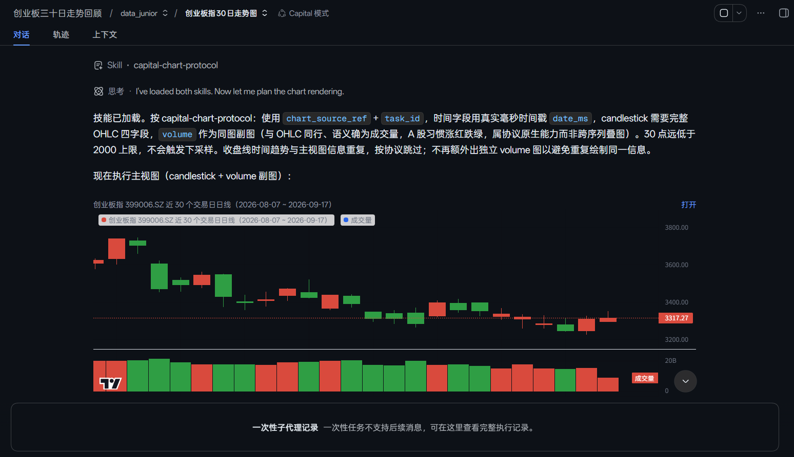
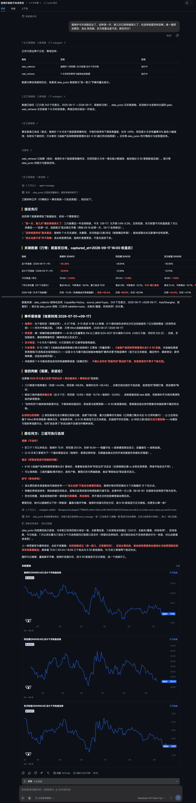

<p align="center">
  
</p>

<p align="center">
  <a href="https://github.com/v587d/capital-generation"></a>
  <a href="https://github.com/v587d/capital-generation"></a>
</p>
<p align="center">
  <a href="https://github.com/deepseek-ai"></a>
  <a href="https://github.com/deepseek-ai"></a>
  <a href="https://github.com/deepseek-ai"></a>
</p>
<p align="center">
  <a href="https://awesome-dsh-plugin.com"></a>
  <a href="LICENSE"></a>
  <a href="https://github.com/v587d/capital-generation/releases"></a>
</p>

> [!IMPORTANT]
> 本项目长期处于探索阶段，不提供任何形式的金融服务，不承诺任何投资回报，投资需审慎。 盈亏自负，与本项目一概无关。
>
> 愿大家的财富数字就像"text generation"一样，不断增长，永不停止。

> [!NOTE]
> 先安装 [Deepseek Harness(DSH)](https://github.com/deepseek-ai/deepseek-harness) ，目前已适配 DSH`@0.1.5-rc.1` 。
> LLM 建议 **Deepseek/deepseek-flash** 搭配本项目， GPT / Claude 尚未充分测试，理论亦可。

# Slogan
Next-Gen AI-Driven Capital Generation.

# What
Capital Generation 是面向中国散户，适用于日常证券研究的 DSH 插件，简单地说：
1. Agent preset（人设）：面向金融场景的 Capital 模式，与 DSH 默认的标准、PTC、极简、创造模式并列。

2. 所有 Agent，包括主 Agent 均不能直接接触原始结构数据（行情、财务报表细目等），需要时 Agent 可按需提取再提炼发送消息至主 Agent。
目前覆盖以下 Subagent（data_analyst 为预留角色，暂未启用）：
  - data_collector: 主 Agent 直属下级（spawn），负责根据上级指令收集金融财经类结构化数据，目前支持 同花顺（fuyao）约61个数据 API接口。
  - data_junior: 主 Agent 直属下级（spawn），负责根据上级指令清洗、整理出有效数据、基础描述性统计以及数据透视，目的是阐述数据背后的“故事”。
  - data_analyst: 主 Agent 直属下级，负责根据上级指令，通过运用编程技能分析上游数据（**仍在开发中**，委派行 disabled，暂不启用）。
  - web_retriever: 主 Agent 直属下级（spawn），负责根据上级指令，运用网络搜索和抓取能力，获取外部非结构化数据，目前支持 AnySearch(search/fetch) API 数据接口和 Wind Alice 相关服务。
  - visualization_specialist: 主 Agent 的孙 Agent（data_junior 的 one-shot 前台子 Agent），由 data_junior 在 profile 完成后的可视化 gate 中按需创建；只接收 `profile_ref`、有限 profile 事实与短期 `chart_source_ref`，使用受控 `render_chart` 生成自包含 HTML 图表，并只向 data_junior 回传 `chart_ref` 小回执；不接触原始 rows、不向主 Agent 直接发消息，当前是唯一的 one-shot 角色。
  - 未来更多，欢迎 PR 

3. 沿用 DSH 官方基础设施，不自行实现底层机制：
  - **Subagent 编排**：通过官方 `dsh-subagent` 行注册委派工具，子 Agent 的创建、消息收发与生命周期管理完全交给宿主；本插件只定义每个角色的 persona 与 toolFilter。
  - **人设注入**：通过官方 `dsh-persona` 行声明主 Agent 人设，不占用 `deployment:persona` 节；子 Agent 人设由委派行 `config.persona` 承载，由宿主自动注入子 Agent 作用域。
  - **技能注入**：主 persona 只保留每轮都要生效的硬规则（预检、复用、路由、合规），长协议与载荷示例放在 preset 自带的 `skills/` 目录，由 `dsh-skill-filesystem` + `dsh-tool-skill` 两行按需加载；插件代码不注册 skill provider。
  - **工作区约定**：通过官方 `dsh-agent-instructions` 行加载工作区 `AGENTS.md` / `CLAUDE.md`。
  - **上下文压缩**：通过官方 `dsh-compaction-basic` / `dsh-compaction-tool-result-pruner` 行提供长会话压缩与大结果剪枝。
  - **数据持久化**：通过宿主侧 `fs` / `sandboxPolicy` 服务完成 Dataset 落盘与权限校验，不直接操作文件系统；所有数据落在用户 workspace，服从当前 session 的沙箱策略。
  - **凭据管理**：通过宿主侧 `credentials` 服务解析 API Key 引用，不硬编码、不缓存、不自行存储密钥。
  - **工具注册**：通过官方 `tools` 服务向会话注册模型工具，由宿主统一管理工具的生命周期与权限控制。
  - **用户交互**：复用官方 `ask_user_question`、`todo_write`、`send_message`、`list_agents` 等工具，不重复造轮子。
 
## data_collector 能力总表

[data_collector 能力总表](docs/data-collector-capabilities.md) 列出全部 **61 个**数据 capability（元数据 / A股行情与财务 / 估值竞价 / 盘面特色 / 指数 / 基金），含端点路径、主要参数（必填以 `*` 标注）、是否分页与用途，并说明**不覆盖**的模块及原因。

## 图表呈现（截图）

> 出图只有一个入口：`data_junior` 的可视化 gate → one-shot `visualization_specialist`。
> 序列数据不进模型上下文，浏览器经宿主旁路取数；图表由宿主追加的 `capital/chart-rendered`
> 事件渲染在**本轮答复下方的收尾卡片**里。下图为真实会话截图，点击可查看原图。

| 收尾卡片：K 线 + 成交量 | 侧栏自包含 HTML：折线 | 侧栏自包含 HTML：K 线 + 量价 |
| :---: | :---: | :---: |
| [](assets/chart-turn-tail-candlestick.png) | [](assets/chart-line-sidebar.png) | [](assets/chart-candlestick-sidebar.png) |
| 创业板指 30 日走势 | 指南针近一月日成交额 | 指南针近一月日线·量价 |

`chart.html` 自包含（内联图表库与数据），可离线打开、零外部请求；图内保留
`Lightweight Charts™ v5.2.1 (Apache-2.0)` 归属信息。

## 样例
[报告样例（最新）](docs/sample/指南针综合研判分析完整报告.md)

**完整分析报告（内嵌图表）**

<p align="center">
  <a href="assets/sample-report-with-chart.png">
    
  </a>
  <br>
  <em>长截图，建议点击查看原图</em>
</p>

## 安装到 DSH Web Profile
> [!NOTE]
> 请务必前往 [同花顺（fuyao）](https://fuyao.aicubes.cn/docs/) 和 [AnySearch](https://www.anysearch.com/docs) **免费**获取 API 密钥。
> 推荐 **免费** 获取 [Wind Alice](https://market.windalice.com/#/home) API 密钥，每日300积分重置，一般够日常使用。
> 同花顺(fuyao)提供结构化数据、 AnySearch 提供实时网络搜索、 Wind Alice 提供公告、信披类文档。

打开本地 `~/.dsh/.credentials.yaml`，按照以下示例添加进去，**注意密钥名称与下方示例保持一致！！！**。
```yaml
ANYSEARCH_API_KEY: as_sk_......
FUYAO_API_KEY: sk-fuyao-......

# 推荐
WIND_API_KEY: ak_......
```

接着，从 GitHub 安装插件（构建产物 `lib/` 已随仓库提交，**无需**克隆本项目或自行构建）：
```bash
dsh plugin --profile web add github:v587d/capital-generation
```

安装后，重启 Web profile 使装配生效。新会话在 Agent Preset 选择器中选择 Capital 模式。


也可以在 Settings 中设置其为默认模式。


## 本地开发 / 构建 / 测试

```bash
npm install
npm run build        # 生成 lib/ 与 chart-ui/client.js
npm test             # 构建后运行全部测试
npm run check:dsh    # 检查上游 DSH 扩展面兼容性，升级/发布前建议跑
npm run smoke:boot   # 冒烟验证装配可正常 boot
```

构建产物 `lib/` 已随仓库提交，普通用户从 GitHub 安装时**无需**本地构建；只有需要改插件源码或
维护子包时才需要执行以上命令。

# 贡献
可自行克隆本项目，按上方「本地开发 / 构建 / 测试」执行。
由于本项目正在迭代中，具体贡献规则见[CONTRIBUTING](CONTRIBUTING.md)，提 PR 前建议 rebase.
欢迎提 issue 和 PR.

[DSH 官方社区](https://github.com/deepseek-ai/deepseek-harness/discussions/6947)

[Captail Generation 项目社区](https://github.com/v587d/capital-generation/discussions)

# MIT


