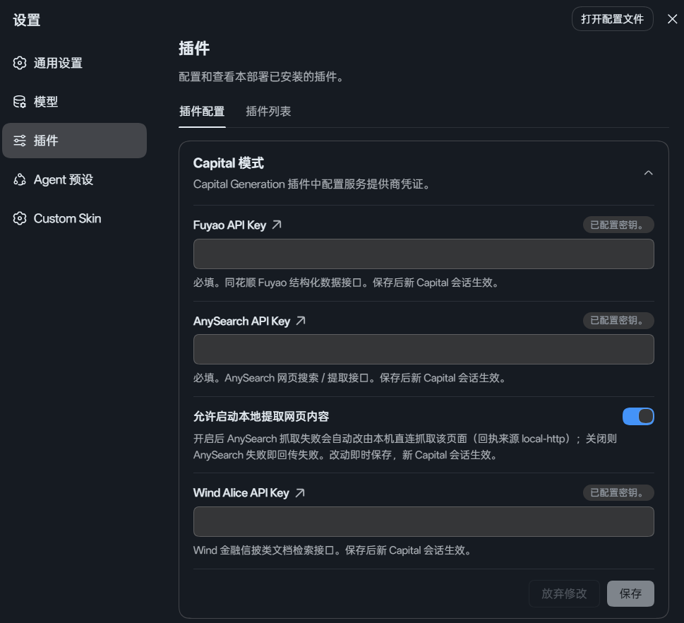
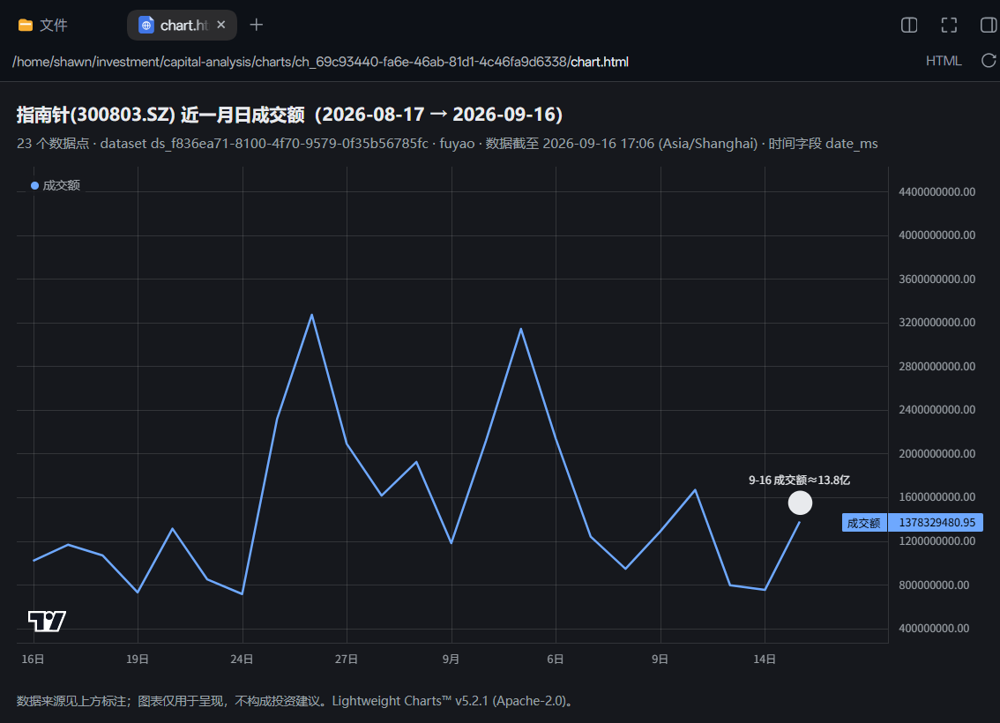
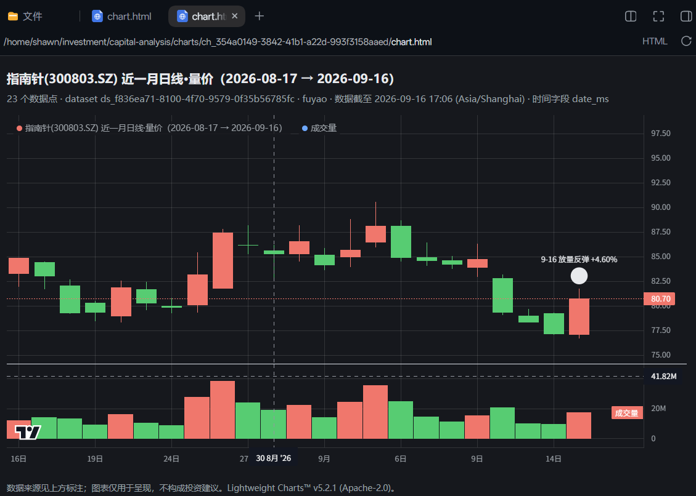
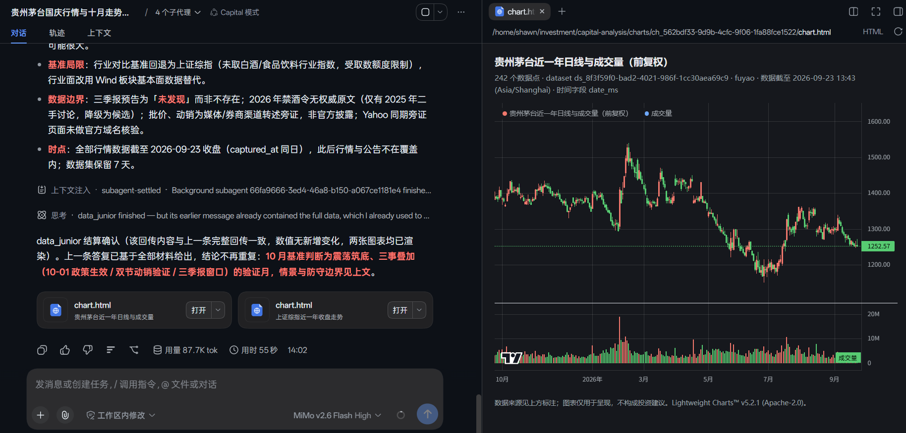

<p align="center">
  
</p>

<p align="center">
  <a href="https://github.com/v587d/capital-generation"></a>
  <a href="https://github.com/v587d/capital-generation"></a>
</p>
<p align="center">
  <a href="https://github.com/deepseek-ai"></a>
  <a href="https://github.com/deepseek-ai"></a>
  <a href="https://github.com/deepseek-ai"></a>
</p>
<p align="center">
  <a href="https://awesome-dsh-plugin.com"></a>
  <a href="LICENSE"></a>
  <a href="https://github.com/v587d/capital-generation/releases"></a>
</p>

> [!IMPORTANT]
> 本项目长期处于探索阶段，不提供任何形式的金融服务，不承诺任何投资回报。 投资需审慎， 盈亏自负，与本项目一概无关。
>
> 愿大家的财富数字就像"text generation"一样，不断增长，永不停止。

> [!NOTE]
> 先安装 [Deepseek Harness(DSH)](https://github.com/deepseek-ai/deepseek-harness) ，目前已适配 DSH`@0.1.5-rc.2` 。
> 建议使用 **Deepseek/deepseek-flash**(High thinking) 搭配本项目， GPT / Claude 尚未充分测试，理论亦可。

# Slogan
Next-Gen AI-Driven Capital Generation.

## 样例
[报告样例（最新）](docs/sample/指南针技术分析报告.md)

## 安装到 DSH Web Profile

从 GitHub 安装插件（构建产物 `lib/` 已随仓库提交，**无需**克隆本项目或自行构建）：
```bash
dsh plugin --profile web add github:v587d/capital-generation
```
安装后，重启 Web profile 使装配生效。
然后在 设置 → 插件 → 插件配置 → Capital 模式 里填入 API Key：

| 配置 API Key |
| :---: |
| [](assets/settings-plugins_1.png) |

> [!NOTE]
> 密钥都是免费申请的：必填 [同花顺（fuyao）](https://fuyao.aicubes.cn/docs/)（行情、财务等结构化数据）；
> 必填 [AnySearch](https://www.anysearch.com/docs)（实时网络搜索）；
> 推荐 [Wind Alice](https://market.windalice.com/#/home)（公告与信披文档，每天送 300 积分，日常够用）。
>
> 在设置里粘贴保存即可，重启后新开的 Capital 会话就能用。
> 同一卡片下方的 **「允许启动本地提取网页内容」** 开关（默认开启）控制抓取回退：
> 开启时 AnySearch 抓取失败会自动改由本机直连抓取该页面（回执 `via` 标注 `local-http`），
> 关闭则失败原样回传；改动即时保存，新 Capital 会话生效。
>
> 除上述三个密钥外不再需要任何 key：`data_collector` 的腾讯 / 东方财富公开能力，以及 `web_retriever`
> 的九个具名来源查询工具（财联社、华尔街见闻、巨潮、上证e互动、东财、新浪、同花顺）都走公开端点，
> 装好即可用。
>
> 不想用设置界面的话，也可以直接把密钥写进 `~/.dsh/.credentials.yaml`，名字用
> `FUYAO_API_KEY`、`ANYSEARCH_API_KEY`、`WIND_API_KEY`，插件会自动读取。

### 简单用法

| 选择 Capital 模式 | 设为默认模式 |
| :---: | :---: |
| [](assets/mode_selector.png) | [](assets/set_default.png) |
| 新会话在 Agent Preset 选择器中选择 Capital 模式 | 也可以在 Settings 中设为默认模式 |

# What
Capital Generation 是面向中国散户，适用于日常证券研究的 DSH 插件，简单地说：
1. Agent preset（人设）：面向金融场景的 Capital 模式，与 DSH 默认的标准、PTC、极简、创造模式并列。

2. 所有 Agent，包括主 Agent 均不能直接接触原始结构数据（行情、财务报表细目等），需要时 Agent 可按需提取再提炼发送消息至主 Agent。
目前覆盖以下 Subagent（data_analyst 为预留角色，暂未启用）：
  - data_collector: 主 Agent 直属下级（spawn），负责根据上级指令收集金融财经类结构化数据，目前支持 **69 个数据 capability**：同花顺（fuyao）61 个（行情、财务、估值竞价、盘面特色、指数、基金），腾讯公开 HTTP 3 个（实时行情快照 / 复权与分钟 K 线 / 分笔，行情 fallback），东方财富 HTTP 5 个（龙虎榜汇总、限售解禁日历、板块行情排名与资金流）。后两类走公开端点，无需额外密钥。
  - data_junior: 主 Agent 直属下级（spawn），负责根据上级指令清洗、整理出有效数据、基础描述性统计以及数据透视，目的是阐述数据背后的“故事”。读一份 Dataset 默认走 `describe_dataset`（一次调用完成元数据 + 基础 profile + 受控查询，多份数据在同一条消息里并发）；时间窗与时间戳换算一律由宿主完成（`time_facts` 的 `axis` / `windows`、`resolve_data_time_range`），子 Agent 不自行把日期算成毫秒。
  - data_analyst: 主 Agent 直属下级，负责根据上级指令，通过运用编程技能分析上游数据（**仍在开发中**，委派行 disabled，暂不启用）。
  - web_retriever: 主 Agent 直属下级（spawn），负责根据上级指令，运用网络搜索和抓取能力，获取外部非结构化数据。检索面为 AnySearch（`anysearch_search` / `web_retriever_fetch`，失败可按开关回退本机直连）与 Wind Alice（`wind_docs_announcements` / `wind_docs_news`，公告与权威新闻）；另有九个**具名来源查询工具**（财联社快讯、华尔街见闻快讯、东财 7×24 快讯 / 个股新闻 / 个股研报、新浪研报、同花顺机构一致预期 EPS、巨潮互动易、上证e互动），均为公开端点、零密钥，详见下方能力小节。
  - visualization_specialist: 主 Agent 的孙 Agent（data_junior 的 one-shot 前台子 Agent），由 data_junior 在 profile 完成后的可视化 gate 中按需创建；只接收 `profile_ref`、有限 profile 事实与短期 `chart_source_ref`，使用受控 `render_chart` 生成自包含 HTML 图表，并只向 data_junior 回传 `chart_ref` 小回执；不接触原始 rows、不向主 Agent 直接发消息，当前是唯一的 one-shot 角色。
  - 未来更多，欢迎 PR 

3. 沿用 DSH 官方基础设施，不自行实现底层机制：
  - **Subagent 编排**：通过官方 `dsh-subagent` 行注册委派工具，子 Agent 的创建、消息收发与生命周期管理完全交给宿主；本插件只定义每个角色的 persona 与 toolFilter。
  - **人设注入**：通过官方 `dsh-persona` 行声明主 Agent 人设，不占用 `deployment:persona` 节；子 Agent 人设由委派行 `config.persona` 承载，由宿主自动注入子 Agent 作用域。
  - **技能注入**：主 persona 只保留每轮都要生效的硬规则（预检、复用、路由、合规），长协议与载荷示例放在 preset 自带的 `skills/` 目录，由 `dsh-skill-filesystem` + `dsh-tool-skill` 两行按需加载；插件代码不注册 skill provider。
  - **工作区约定**：通过官方 `dsh-agent-instructions` 行加载工作区 `AGENTS.md` / `CLAUDE.md`。
  - **上下文压缩**：通过官方 `dsh-compaction-basic` / `dsh-compaction-tool-result-pruner` 行提供长会话压缩与大结果剪枝。
  - **数据持久化**：通过宿主侧 `fs` / `sandboxPolicy` 服务完成 Dataset 落盘与权限校验，不直接操作文件系统；所有数据落在用户 workspace，服从当前 session 的沙箱策略。
  - **凭据管理**：通过宿主侧 `credentials` 服务解析 API Key 引用，不硬编码、不缓存、不自行存储密钥。
  - **工具注册**：通过官方 `tools` 服务向会话注册模型工具，由宿主统一管理工具的生命周期与权限控制。
  - **用户交互**：复用官方 `ask_user_question`、`todo_write`、`send_message`、`list_agents` 等工具，不重复造轮子。
 
## data_collector 能力总表

[data_collector 能力总表](docs/data-collector-capabilities.md) 列出全部 **69 个**数据 capability（元数据 / A股行情与财务 / 估值竞价 / 盘面特色 / 指数 / 基金 / 腾讯公开行情 fallback / 东方财富资金与筹码），含端点路径、主要参数（必填以 `*` 标注）、是否分页与用途，并说明**不覆盖**的模块及原因。表格由 `npm run docs:capabilities` 从 source 定义生成，测试断言「文档 == 实现」。

构成：同花顺 Fuyao **61** 个（需 `FUYAO_API_KEY`）、腾讯公开 HTTP **3** 个（`tencent_quote` / `tencent_kline` / `tencent_ticks`）、东方财富 HTTP **5** 个（`eastmoney_top_buy_sell_market` / `eastmoney_top_buy_sell_ticker` / `eastmoney_lockup_expiry` / `eastmoney_sector_rotation` / `eastmoney_cashflow_rotation`）；后两类为公开端点，**无需额外密钥**。

## web_retriever 能力（检索 + 来源查询）

web_retriever 有两个工作面，共 **13 个工具**：

- **检索**（发现候选 → 按 URL 取正文）：`anysearch_search`（AnySearch 全网搜索）、
  `web_retriever_fetch`（抓取正文，AnySearch 失败时按开关回退本机直连，回执 `via` 标注实际来源）、
  `wind_docs_announcements` / `wind_docs_news`（Wind Alice 公告与权威新闻，默认第一选择）。
- **来源查询**（具名来源 + 业务参数 → 确定、有序、可翻页、同参可复现的结果集；全部公开端点、零密钥）：

| 来源 | 工具 | 用途 |
|---|---|---|
| 财联社 | `cls_telegraph` | 7×24 全市场快讯（签名本地计算、零 key） |
| 华尔街见闻 | `wscn_lives` | 7×24 快讯，按 `channel` + `cursor` 翻页 |
| 东方财富 | `eastmoney_724` | 7×24 快讯，与财联社 / 见闻三条互为备份（聚合内容按标题去重） |
| 东方财富 | `eastmoney_stock_news` | 个股新闻（区分「上游风控」与「该股确实没有新闻」） |
| 东方财富 | `eastmoney_reports` | 个股研报列表（含评级与逐篇预测 EPS；研报正文是 PDF，不在覆盖范围） |
| 新浪 | `sina_reports` | 研报第二来源（不含评级与目标价） |
| 同花顺 | `ths_eps_forecast` | 机构一致预期 EPS（逐年：机构数 / 最小 / **均值** / 最大 / 行业平均） |
| 巨潮互动易（深市） | `cninfo_irm` | 投资者问答：公司怎么回应某传闻 / 关切 |
| 上证e互动（沪市） | `sseinfo_qa` | 沪市投资者问答，不传 `code` 可看全市场最新 |

来源边界（深沪不可互换、北交所两边都没有、研报正文取不到）、翻页纪律（该翻页就翻到没有、空结果是真事实）
与回传格式见 [capital-web-protocol](preset/capital-generation/skills/capital-web-protocol/SKILL.md)。

## 图表呈现（截图）

> 出图只有一个入口：`data_junior` 的可视化 gate → one-shot `visualization_specialist`。
> 序列数据不进模型上下文；图表由宿主以**官方** `deliverables/presented` 登记为**本轮交付物**，
> 在收尾的「本轮文件改动 / 交付」行点开即可在右侧看到可交互图表。以下均为真实会话截图，点击可查看原图。

| 侧栏自包含 HTML：折线 | 侧栏自包含 HTML：K 线 + 量价 |
| :---: | :---: |
| [](assets/chart-line-sidebar.png) | [](assets/chart-candlestick-sidebar.png) |
| 某股票近一月日成交额 | 某股票近一月日线·量价 |

| 同一窗口：左侧报告 · 右侧侧栏图表 |
| :---: |
| [](assets/left-report-right-chart.png) |

`chart.html` 自包含（内联图表库与数据），可离线打开、零外部请求；图内保留
`Lightweight Charts™ v5.2.1 (Apache-2.0)` 归属信息。

## 本地开发 / 构建 / 测试

```bash
npm install
npm run build        # 生成 lib/ 与两个浏览器端产物（chart-ui、capital-config）
npm test             # 构建后运行全部测试
npm run check:dsh    # 检查上游 DSH 扩展面兼容性，升级/发布前建议跑
npm run smoke:boot   # 冒烟验证装配可正常 boot
```

构建产物 `lib/` 已随仓库提交，普通用户从 GitHub 安装时**无需**本地构建；只有需要改插件源码或
维护子包时才需要执行以上命令。

## Changelog

### 2.2.0 — 2026-09-24

- **data_collector 扩到 69 个能力（61 → 69，零新增密钥）**：新增腾讯公开 HTTP 3 个
  （`tencent_quote` 实时快照 / `tencent_kline` 复权与分钟 K 线 / `tencent_ticks` 分笔，行情 fallback）
  与东方财富 HTTP 5 个（龙虎榜全市场与单票汇总、限售解禁日历、板块行情排名、板块资金流）；
  时间窗同步接入 `resolve_data_time_range`，能力总表由 `npm run docs:capabilities` 重新生成，
  测试断言「文档 == 实现」。
- **web_retriever 新增九个具名来源查询工具**：`cls_telegraph`（财联社 7×24 快讯，签名本地计算、零 key）、
  `wscn_lives`（华尔街见闻快讯，按 `channel` + `cursor` 翻页）、`eastmoney_724`（东财 7×24 快讯，
  与前两条互为备份）、`cninfo_irm`（巨潮互动易问答，深市）、`sseinfo_qa`（上证e互动问答，沪市）、
  `eastmoney_stock_news`（个股新闻）、`eastmoney_reports`（个股研报列表）、`sina_reports`
  （研报第二来源，不含评级与目标价）、`ths_eps_forecast`（机构一致预期 EPS，逐年给出机构数 / 最小 /
  **均值** / 最大 / 行业平均）。它们与检索工具是两个工作面：**检索**是发现候选、按 URL 取正文；
  **查询**是"具名来源 + 业务参数 → 确定、有序、可翻页、同参可复现的结果集"，
  该翻页就翻到没有，空结果是真事实。回执带 `count` / `next_cursor` / `note`，
  并按来源分别计入 `provider_tally`。
- **东财请求收敛到一份网络面**：进程级共享客户端 + 串行最小间隔（350ms），数据面与 web_retriever
  共用同一个节流器——东财按出口 IP 风控，两套独立限流等于没限。
  （`DataCollectorHub` 的 FIFO 只保证"同一时刻一个请求"，**不含最小间隔**：串行 ≠ 节流。）
- **改名**：`web_retriever_search` → **`anysearch_search`**（按 provider 命名，与 `wind_docs_*` 同口径）。
  `web_retriever_fetch` 不改名——它是一条 AnySearch→本机直连的**回退链**，回执 `via` 标明实际来源。
- **修复**：本机直连不再改写 JSON 正文（此前数组括号变 `\[ \]` 让 `JSON.parse` 失效、字段名被转义）、
  接受 `json/javascript` 类 MIME、上证e互动公司列表改按 `<a>` 元素解析（窗口式正则会跨条目错配
  uid↔代码）；东财研报预测 EPS 因上游返回**字符串**而恒为 null；新浪研报的日期与类型两列写反、
  个股查询缺交易所前缀会拿到**假空页**（真实原因不是限流）；`eastmoney_stock_news` 现在区分
  "上游风控"与"该股确实没有新闻"；同花顺一致预期页是 GBK 而响应头不带 charset，按 UTF-8 解会整页
  变替换字符。

从 2.1.2 升级需迁移一处：自定义 prompt / 脚本里的 `web_retriever_search` 改读 `anysearch_search`
（能力与入参不变）；其余升级无需改调用方式，新增能力均为公开端点、无需新增密钥。
完整变更历史见 [CHANGELOG.md](CHANGELOG.md)。

### 2.1.2 — 2026-09-23

- **`describe_dataset`（读 Dataset 的默认入口）**：一次调用完成元数据 + 基础 profile + 可选受控查询，
  多份数据在同一条消息里并发执行；结果超过 7000 码点时返回带完整列名的 `too_large` 小回执，
  而不是把超长载荷丢给剪枝器截断。
- **时间换算交给宿主**：`time_facts` 增 `axis` / `windows[]` / `covered_*_iso`；`query_dataset` 的
  filter 直接写 `2026-08-23` / `2026-08` / `{ "period": "last_1_month" }`；`resolve_data_time_range`
  新增 Dataset 形态（传 `dataset_id + period`，返回的边界可直接填 filter）。子 Agent 不再自行把日期算成毫秒。
- **修复**：`resolve_data_time_range` 两种形态此前一个必失败、一个报无权限；`describe_dataset`
  内嵌 queries 的时间筛选与 `query_dataset` 行为不一致；`last_N_week` 退化成 0 天；日期串落到
  数值时间列被静默跳过等。

非破坏性新增，从 2.1.1 升级无需迁移（两处结果收紧的细节见 CHANGELOG）。完整变更历史见 [CHANGELOG.md](CHANGELOG.md)。

### 2.1.1 — 2026-09-22

- **设置卡片**：新增 设置 → 插件 → 插件配置 → Capital 模式，可视化配置 Fuyao / AnySearch /
  Wind API Key，并可开关「允许启动本地提取网页内容」（默认开启）。
- **抓取回退**：AnySearch fetch 失败且开关开启时，自动改由本机直连抓取该页面并抽取正文
  （回执 `via` 标注 `anysearch` | `local-http`），失败语义按结构化错误码归类。

非破坏性新增，从 2.1.0 升级无需迁移。

# 贡献
可自行克隆本项目，按上方「本地开发 / 构建 / 测试」执行。
由于本项目正在迭代中，具体贡献规则见[CONTRIBUTING](CONTRIBUTING.md)，提 PR 前建议 rebase.
欢迎提 issue 和 PR.

[DSH 官方社区](https://github.com/deepseek-ai/deepseek-harness/discussions/6947)

[Capital Generation 项目社区](https://github.com/v587d/capital-generation/discussions)

# MIT


