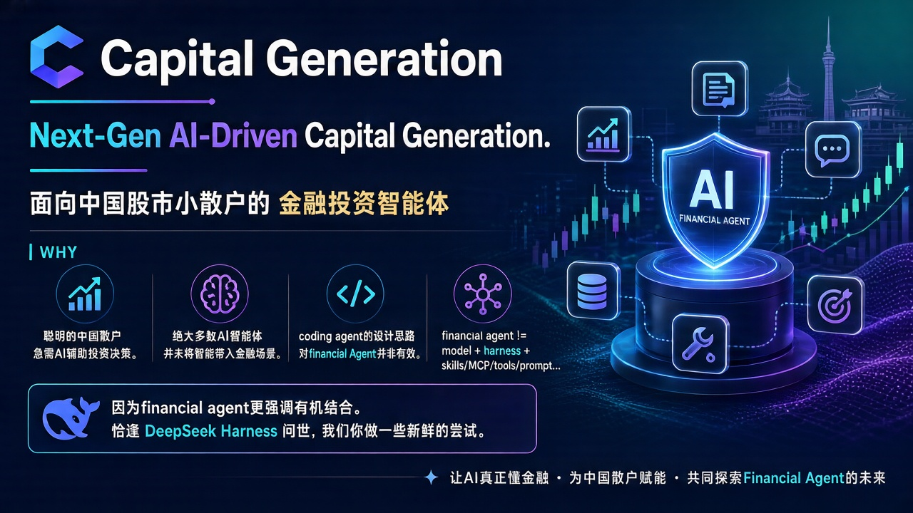

<p align="center">
  
</p>

<h1 align="center">Capital Generation</h1>

<p align="center">
  
</p>

<p align="center">
  <a href="https://github.com/deepseek-ai"></a>
  <a href="https://github.com/deepseek-ai"></a>
  <a href="https://github.com/v587d/capital-generation"></a>
  <a href="https://awesome-dsh-plugin.com"></a>
</p>

<p align="center">
  <a href="https://www.python.org/"></a>
  <a href="https://docs.astral.sh/uv/"></a>
  <a href="https://modelcontextprotocol.io/"></a>
  <a href="LICENSE"></a>
  <a href="https://github.com/v587d/capital-generation/releases"></a>
</p>

> [!IMPORTANT]
> 愿大家的财富数字就像“text generation”一样，不断增长，永不停止。

## Slogan
Next-Gen AI-Driven Capital Generation.

## What
面向中国股市小散户的金融投资智能体

## Why
- 聪明的中国散户急需AI辅助投资决策。
- 绝大多数AI智能体并未将智能带入金融场景。
- coding agent的设计思路对financial Agent并非有效。
- financial agent != model + harness + skills/MCP/tools/prompt...
- 因为financial agent更强调有机结合。恰逢 DeepSeek Harness 问世，我们一起做一些新鲜的尝试。

## BYOK

> [!WARNING]
> 本项目不提供第三方 API Key，需你自行申请。仓库内不保存任何密钥。

### 申请 Key

- **Wind**：免费获取 API Key，每天送 1000 积分（有效期 1 天），初始 2000 积分。[→ 访问官网申请](https://aifinmarket.wind.com.cn/#/home)
- **同花顺**：免费获取 API Key，免费使用，对高频请求有限制。[→ 访问官网申请](https://fuyao.aicubes.cn/)
- **AKShare**：无需 Key，作为免费兜底源直接可用。

### 配置方法

拿到 Key 后，任选以下一种方式配置，推荐使用 credentials 文件：

1. 将 Key 写入 `~/.dsh/.credentials.yaml`（权限建议 `0600`）：

   ```yaml
   ths_api_key: "你的同花顺 API Key"
   wind_api_key: "你的 Wind API Key"
   ```

2. 或者通过环境变量注入：

   ```bash
   export THS_API_KEY="你的同花顺 API Key"
   export WIND_API_KEY="你的 Wind API Key"
   ```

3. 重启 DSH / 重新启动 MCP server 后生效。未配置的源会给出 warning 并自动降级到可用兜底源，不会阻断启动。

> [!TIP]
> 如果你通过 DSH 接入，且选择环境变量方式，请确认 `cordis.patch.yml` 的 `env` 中显式透传了 `THS_API_KEY` / `WIND_API_KEY`；否则 DSH 的 MCP 子进程可能拿不到 Key。

## 能力一览（v0.3.1）

统一金融数据访问入口：**11 个 `fin_data__*` MCP 工具**，一个入口覆盖 A 股行情 / K线 / 财务 / 日历 / 特色数据 / 公告 / 宏观 EDB / 双源对账 / 基金 / 指数。

| 工具 | 说明 | 主干 → 兜底 |
|---|---|---|
| `fin_data__search_symbols` | 名称/代码消歧 → 唯一 canonical code | 同花顺 → AKShare |
| `fin_data__get_quote` | A股行情快照（批量 ≤50，不含中文名） | 同花顺 → AKShare |
| `fin_data__get_klines` | 日K（≤1 年窗口引导）+ 分钟线（仅单交易日，Wind 独家） | 同花顺 → AKShare / Wind |
| `fin_data__get_financials` | 三表 + 财务指标 | **Wind** → 同花顺 → AKShare |
| `fin_data__get_calendar` | A股近一年交易日历 | 同花顺 → AKShare |
| `fin_data__get_special_data` | 涨停池/连板/热榜/龙虎榜/异动（`anomaly-stock` 需 `thscodes`） | 同花顺 → AKShare |
| `fin_data__get_announcements` | 公告检索（Wind 独家 RAG，无降级源，content 已截断 + url 兜底） | Wind |
| `fin_data__get_edb` | EDB 宏观/行业指标（Wind 主干，AKShare 白名单兜底） | Wind → AKShare |
| `fin_data__reconcile` | 双源对账（未复权，只比数据时点，分歧交 LLM 裁决） | THS × AKShare |
| `fin_data__get_fund_data` | 基金（净值/收益/持仓/持有人/快照/K线） | 同花顺 → Wind |
| `fin_data__get_index_data` | 指数（行情/K线/成分/基本面） | 同花顺 → Wind |

每个结果携带溯源信封：`source`（同花顺/Wind/AKShare）+ `tier`（free/quota/paid）+ `ts` + `warnings[]`。**降级从不静默**；分钟线/公告/指数基本面无降级源，明确告知。

## 设计哲学

- **三源架构，不是三源平权**：同花顺（免费官方 REST）为行情主干，AKShare（免费）兜底，万得 Wind（权威）负责财务/分钟线/公告/EDB 等独家域。
- **上下文预算优先**（v0.3.1 实测，真实 KEY）：结果侧 **-72.2%**、工具面 -9.2%/轮。公告全文截断（`truncated` 显式标注 + url 兜底）、K线表头外提（meta+rows）、schema 去冗余 title——全部在"工具 schema 冻结 + 降级可观测"红线上完成。
- **契约纪律**：工具名与参数 schema 一经发布即冻结，任何变更走 `docs/DESIGN_REVIEW.md` 评审记录；数据模型 L1 身份 / L2 语义 / L3 标注分层，vendor 字段只标注、不转换。
- **BYOK**：所有 Key 由使用者自备（同花顺/Wind），存在 `~/.dsh/.credentials.yaml`，仓库零密钥。

## 快速开始

```bash
# 1. 环境: Python 3.12+ / uv
uv sync

# 2. 配置 Key (env 或 DSH credentials 文件)
#    THS_API_KEY=sk-...   WIND_API_KEY=ak-...
#    或写入 ~/.dsh/.credentials.yaml (0600)

# 3. DSH 接入: cordis.patch.yml 增加一行
- insert:
    - id: finance-unified
      name: '@deepseek-ai/dsh-mcp-client'
      config:
        serverName: fin
        transport: stdio
        command: uv
        args: ['run', '--directory', '/path/to/capital-generation', '-m', 'servers.mcp_data']
        failOnStartupError: true

# 4. 本地验证
uv run python scripts/ci.py        # ruff + pytest + 双源契约
uv run pytest tests -q             # 205 passed + 10 skipped
```

## 数据湖（离线资产）

官方同花顺 marketdb CLI（MIT）整体集成：全市场 **10 年日K + 复权因子** + 近 10 交易日增量，四层表 raw/calc/dim/stg + 8 项质量校验。**纯离线，不进 LLM**（用户裁定）：全市场扫描类需求走 `scripts/lake.py` CLI，工具面明示不支持。

## 项目结构

```
core/       # 纯 Python 数据域: domain (L1/L2/L3 模型) + adapters (THS/Wind/AKShare)
servers/    # MCP 薄壳 (FastMCP): 只注册 fin_data__* 工具, 渲染层含上下文压缩
config/     # 数据即配置: chains.yaml / error_map.yaml / render.yaml / symbols.json
scripts/    # ci.py / lake.py / live-probe.py / measure_tokens.py (token 基线)
tests/      # 离线单测 + fixtures (三源可比性)
assets/     # 效果图
```

## 文档

- `docs/DESIGN_REVIEW.md` — 设计决策与 schema 评审记录（改设计前先读）
- `docs/DEGRADATION.md` — 降级链与错误分类（降级可观测红线）
- `docs/DATA_MODEL.md` — L1/L2/L3 数据模型契约
- `docs/LESSONS.md` — 契约事实与坑（THS/Wind 实测）
- `docs/DESIGN_CONTEXT_BUDGET.md` — 上下文 token 预算方案与实测
- `docs/CONTEXT_BUDGET_RESULTS.md` — v0.3.1 优化前后正式对比数据

## 路线图

| 版本 | 内容 |
|---|---|
| v0.1.0 → v0.3.0 | 数据层：三源架构、对账引擎、数据湖、基金/指数域、CI |
| **v0.3.1**（当前） | 上下文 token 优化（结果侧 -72.2%）、LLM-first 错误消息 |
| v0.4.0 | 编排层 `fin_agent__ask`（plan-only，TS DSH 插件，数据层零改动） |

## License

[Apache-2.0](LICENSE)（含 [NOTICE](NOTICE)）。同花顺/万得 API 为第三方商业服务，其条款独立于本仓库；Key 由使用者自备（BYOK）。
