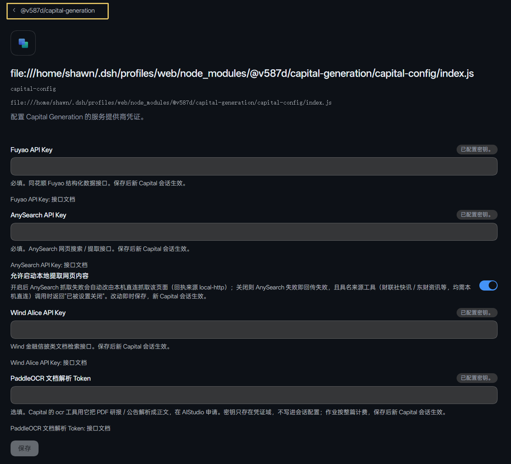

<p align="center">
  
</p>

<p align="center">
  <a href="https://github.com/v587d/capital-generation"></a>
  <a href="https://github.com/v587d/capital-generation"></a>
</p>
<p align="center">
  <a href="https://github.com/deepseek-ai"></a>
  <a href="https://github.com/deepseek-ai"></a>
  <a href="https://github.com/deepseek-ai"></a>
  <a href="https://github.com/deepseek-ai"></a>
</p>
<p align="center">
  <a href="https://awesome-dsh-plugin.com"></a>
  <a href="LICENSE"></a>
  <a href="https://github.com/v587d/capital-generation/releases"></a>
</p>

# Capital Generation

> Next-Gen AI-Driven Capital Generation.

Capital Generation 是运行在 [DeepSeek Harness（DSH）](https://github.com/deepseek-ai/deepseek-harness) 里的证券研究插件，面向关注 A 股（近期开放港美股）的个人用户。安装后，在新会话中选择 **Capital 模式**，就可以用自然语言查行情、财务数据、公告和新闻，整理分析并生成图表。它不是独立应用，需要先安装 DSH。

**视频演示：**[安装、配置与使用](https://www.bilibili.com/video/BV1fzaZ6CE9J/)。

例如，你可以问：「复盘 XXXX 最近 20 个交易日的走势，结合公告和财务数据说明主要变化，并画一张量价图。」[查看报告样例](docs/sample/指南针技术分析报告.md)。

> [!IMPORTANT]
> 本项目仍在探索中，不提供金融服务或投资建议，不保证数据完整、及时或准确，也不承诺投资回报。请自行核对来源并承担投资风险。

## 开始使用

> [!NOTE]
> 适配 DSH`@0.2.0-rc.2`（需要此版本或更新版本）。已在 Linux 的 Web profile 和 Windows 桌面端验证；其他环境尚未充分测试。建议使用 `Deepseek/deepseek-flash` 并开启 High thinking；GPT / Claude 尚未充分测试。

1. **安装插件。**Linux / macOS 的 Web 或 CLI profile 在终端执行：

   ```bash
   dsh plugin --profile web add github:v587d/capital-generation
   ```

   安装后重启该 profile。Windows 桌面端在「添加插件」中输入 `https://github.com/v587d/capital-generation`。桌面端自带 DSH 宿主，不需要单独用 npm 安装宿主。本仓库已包含构建产物，普通用户不需要克隆仓库或运行构建命令。

2. **填写密钥。**打开 DSH「插件」→ 已安装的 `@v587d/capital-generation` →「包含的组件」→ `capital-config`，在配置卡片中填写并保存。**入口在「插件」页，不在「设置」页。**

   | 密钥 | 用途 |
   | --- | --- |
   | [同花顺 Fuyao](https://fuyao.aicubes.cn/docs/)（必填） | 行情、财务数据和自选股报价 |
   | [AnySearch](https://www.anysearch.com/docs)（必填） | 网页搜索和正文提取 |
   | [Wind Alice](https://market.windalice.com/#/home)（推荐） | 公告和金融新闻检索 |
   | [PaddleOCR AIStudio](https://aistudio.baidu.com/paddleocr)（可选） | 解析 PDF 和图片中的文字 |

   这些是第三方服务的密钥，需分别向服务方申请；额度和条款以各服务方为准。没有可选密钥时，对应能力不可用，其他功能仍可使用。保存后**新建 Capital 会话**即可生效，无需重启。也可以将密钥写入 `~/.dsh/.credentials.yaml`，名称依次为 `FUYAO_API_KEY`、`ANYSEARCH_API_KEY`、`WIND_API_KEY`、`PADDLE_OCR_TOKEN`。密钥由 DSH 凭据服务保存，不会显示在会话配置中。

   <p align="center">
     <a href="assets/DSH@0.1.7rc2插件设置_3.png">
       
     </a>
   </p>

3. **新建会话。**在 Agent Preset 选择器中选 **Capital**，然后直接描述研究问题。也可以到「设置」→「Agent 预设」把它设为默认模式。

   <p align="center">
     <a href="assets/mode_selector.png">
       
     </a>
   </p>

## 能做什么

- **查数据和资料：**按需获取行情、财务、指数及基金数据，检索公告、新闻和研报。部分公开数据源无需额外密钥；具体覆盖范围见 [数据能力表](docs/data-collector-capabilities.md) 和 [网页检索能力表](docs/web-retriever-capabilities.md)。
- **整理和画图：**将数据交给不同角色处理，再生成可交互图表。图表会作为本轮交付物出现在会话中，可在侧栏查看或离线打开。了解处理流程可看 [Agent 角色说明](docs/agent-roles.md)。
- **管理自选股：**在 Capital 会话中输入 `/` 或点击输入框旁的 `+`，从「指令」中打开「自选股」。按代码或中文名添加 A 股、指数、ETF，最多 30 条；满了会提示你先删一条。第一次打开时会先放四条主要指数（上证指数、深证成指、创业板指、沪深300）作为起点，删掉后不会再生成。可置顶、移除，打开面板时会刷新报价，之后可手动点「刷新报价」。清单不会自己进入对话：点击某行的「预测」或「复盘」只会把针对该标的的提问填入输入框，**不会替你发送**，可以修改后再发送。刷新失败时已有报价仍显示为旧快照，并标明时间；请勿当作实时价格。

会话中的图表效果：

| 走势折线 | K 线与量价 |
| :---: | :---: |
| <a href="assets/chart-line-sidebar.png"></a> | <a href="assets/chart-candlestick-sidebar.png"></a> |

<p align="center">
  <a href="assets/watchlist-popup.png">
    
  </a>
</p>

## 常见问题

- **安装后找不到 Capital 模式？**确认插件出现在「插件」→ 已安装列表；Web / CLI profile 安装后要重启该 profile，并在新会话选择模式。
- **配置卡片在哪？**在插件详情的 `capital-config` 组件下，不在 DSH 的普通「设置」页面。保存密钥后新建会话再试。
- **桌面端升级后仍是旧版？**桌面端安装时会固定所解析的版本，不会自动升级。卸载后重新安装，再到插件详情查看版本号；如需指定版本，可在地址末尾加 `#v2.5.3`。
- **网页抓取失败？**配置卡片中的「允许启动本地提取网页内容」默认开启：AnySearch 提取失败时可尝试本机直连。关闭后，本机直连的具名来源查询也不可用；请检查该开关和网络连接。

目前 Windows 桌面端有一项[已知宿主差异](CHANGELOG.md)：主 Agent 的部分工具限制可能不生效。请特别留意它实际调用了哪些工具；结构化数据的取数限制仍由工具自身执行。

## 开发与贡献

普通用户不需要执行下面的命令。修改源码时请参考 [贡献指南](CONTRIBUTING.md) 和 [开发约定](AGENTS.md)：

```bash
npm install
npm run build       # 构建 lib/ 和浏览器端资源
npm test            # 构建并运行测试
npm run check:dsh   # 检查 DSH 扩展面兼容性
npm run smoke:boot  # 检查插件装配
```

完整版本历史见 [CHANGELOG.md](CHANGELOG.md)。问题与建议可到 [Issues](https://github.com/v587d/capital-generation/issues) 或 [DSH官方 Discussions](https://github.com/deepseek-ai/deepseek-harness/discussions/6947) 交流。本项目采用 [MIT 许可](LICENSE)。
