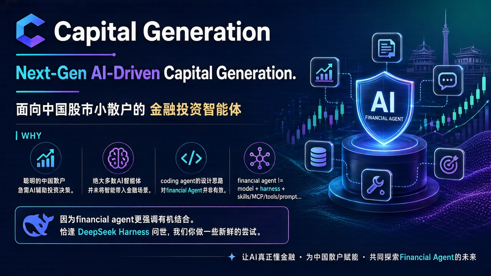
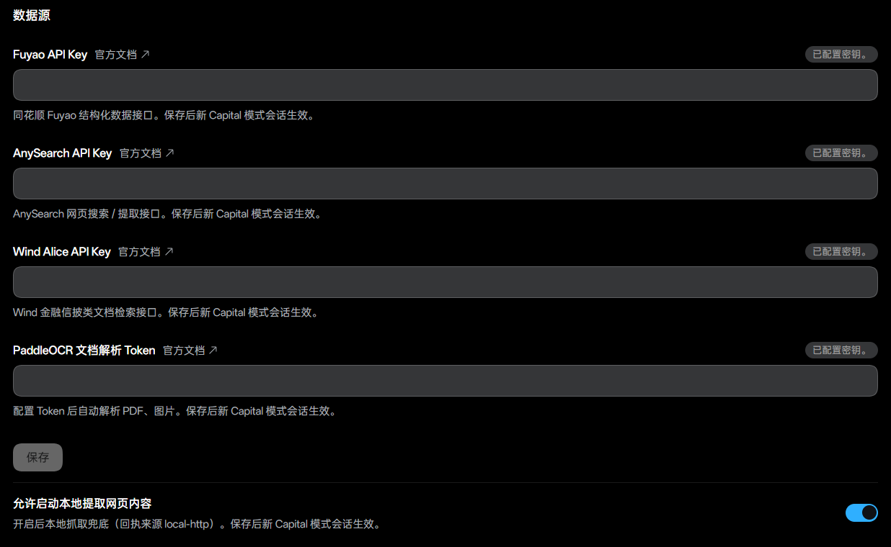
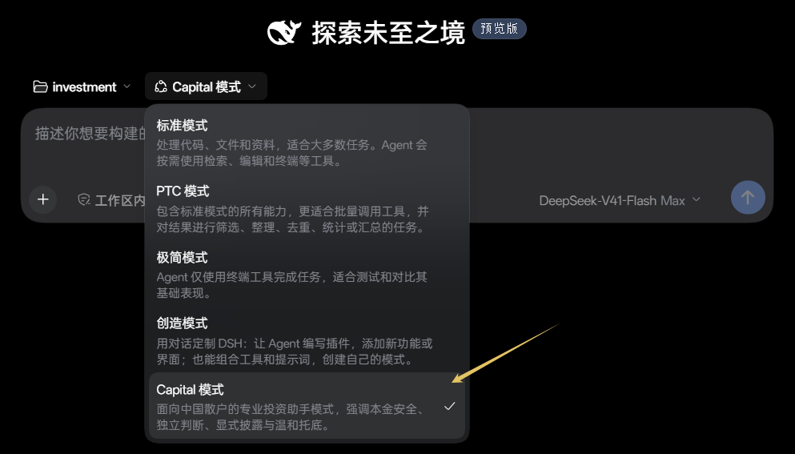
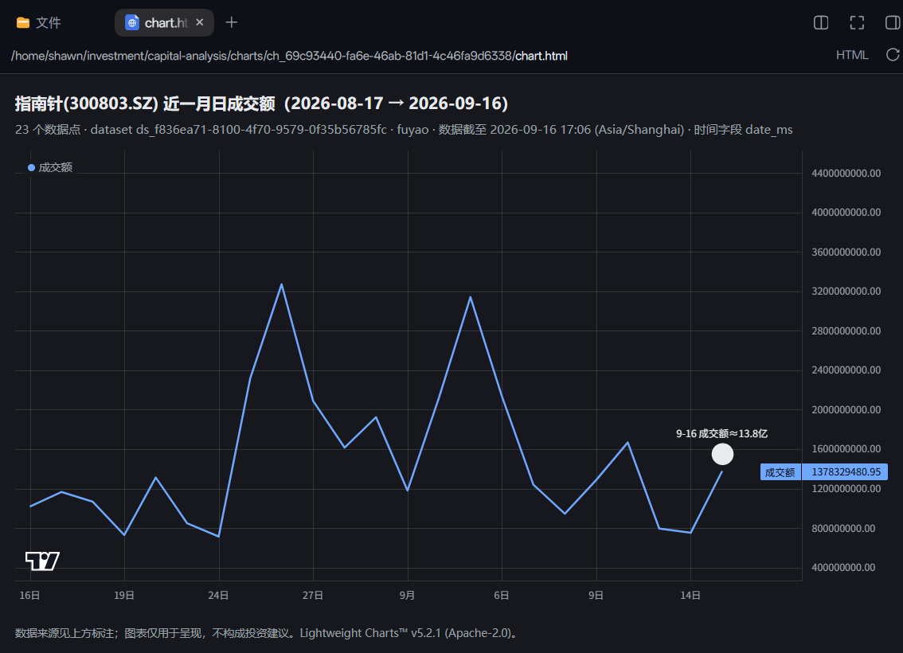
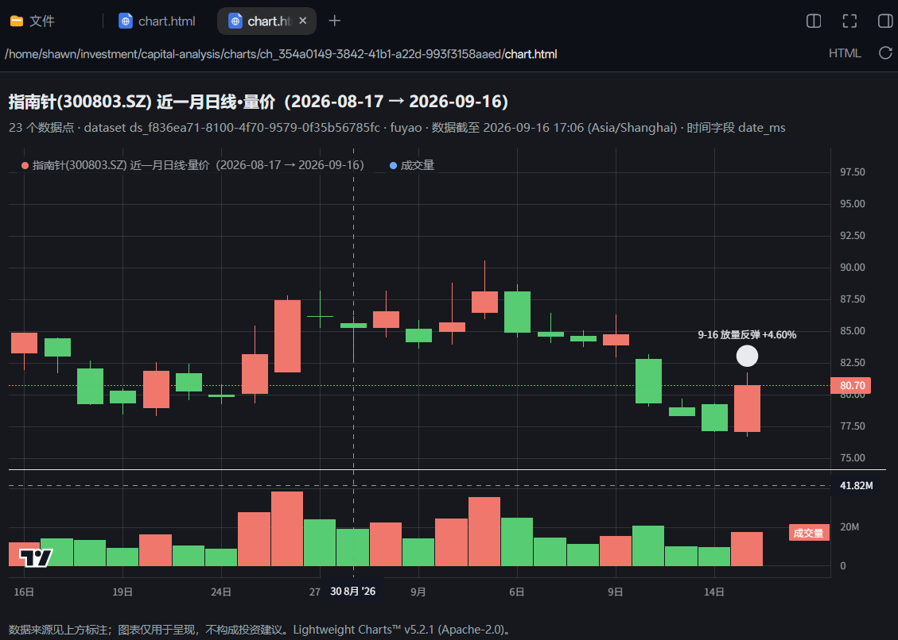
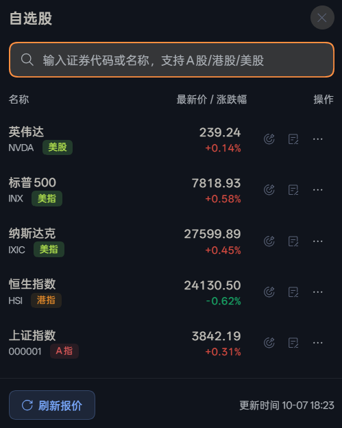
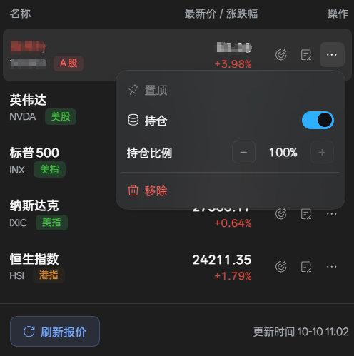
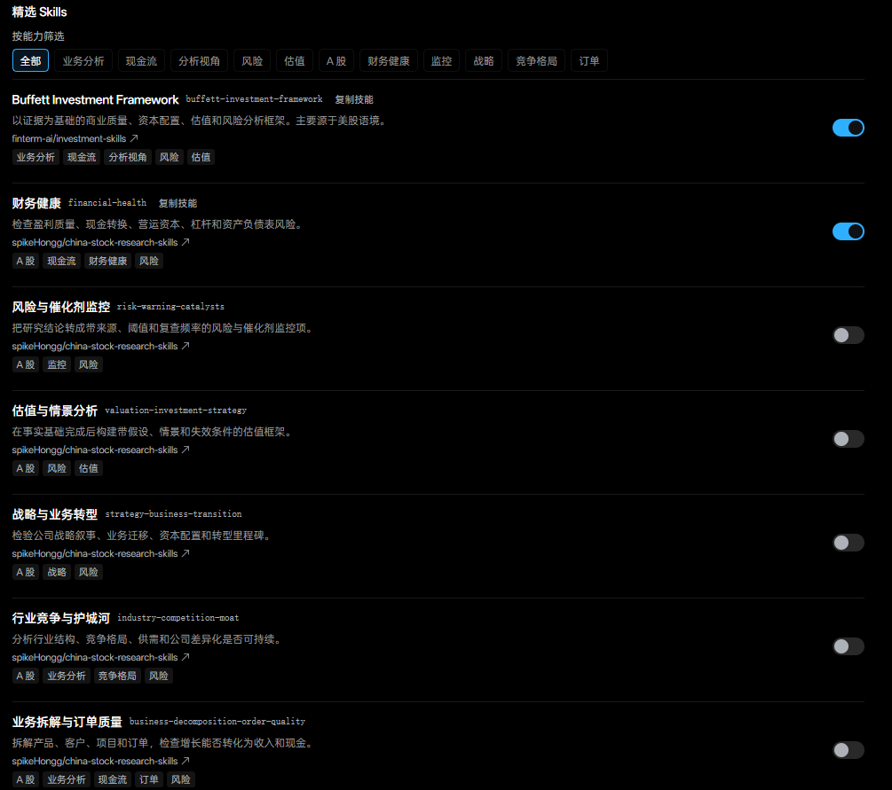

<p align="center">
  
</p>

<p align="center">
  <a href="https://github.com/v587d/capital-generation"></a>
  <a href="https://github.com/v587d/capital-generation"></a>
</p>
<p align="center">
  <a href="https://github.com/deepseek-ai"></a>
  <a href="https://github.com/deepseek-ai"></a>
  <a href="https://github.com/deepseek-ai"></a>
  <a href="https://github.com/deepseek-ai"></a>
</p>
<p align="center">
  <a href="https://awesome-dsh-plugin.com"></a>
  <a href="LICENSE"></a>
  <a href="https://github.com/v587d/capital-generation/releases"></a>
</p>

# Capital Generation

> Next-Gen AI-Driven Capital Generation.

Capital Generation 是运行在 [DeepSeek Harness（DSH）](https://github.com/deepseek-ai/deepseek-harness) 里的证券研究插件，面向关注 A股/港股/美股 的个人投资者。安装后，在新会话中选择 **Capital 模式**，就可以用自然语言查行情、财务数据、公告和新闻，整理分析并生成图表。它不是独立应用，需要先安装 DSH。

**🎞️视频演示：**[安装、配置与使用](https://www.bilibili.com/video/BV1fzaZ6CE9J/)。

> [!IMPORTANT]
> 本项目仍在探索中，不提供金融服务或投资建议，不保证数据完整、及时或准确，也不承诺投资回报。请自行核对来源并承担投资风险。

## 快速上手

> [!NOTE]
> 适配 DSH`@0.2.0-rc.2`。已在 Linux 的 Web profile 和 Windows 桌面端验证；其他环境尚未充分测试。建议使用 `Deepseek/deepseek-flash` ，思考推理能力为 High ；GPT / Claude 尚未充分测试。

1. **安装插件。** 

Linux / macOS 的 Web 或 CLI profile 在终端执行，下面两条 **任选一条** ：

```bash
dsh plugin --profile web add @v587d/capital-generation
```
或
```bash
dsh plugin --profile web add github:v587d/capital-generation
```

两条装完的功能一样：前者取 npm 上已发布的版本，后者取本仓库当前的代码。装后重启该 profile。

DSH 桌面端在 「添加插件」 中输入，下面两条 **任选一条**：

```input
https://github.com/v587d/capital-generation
```
或
```input
@v587d/capital-generation
``` 
桌面端自带 DSH 宿主，不需要单独用 npm 安装宿主。本仓库已包含构建产物，普通用户不需要克隆仓库或运行构建命令。


> [!NOTE]
> 本插件所有自带密钥均可免费申请、免费日常使用。 哪怕所有密钥留空也不影响插件核心功能，即缺哪个密钥，仅表示对应能力就不可用，其他功能照常。

2. **选填密钥。** 打开 DSH 「插件」 → **Capital Generation** →「数据源」（进页面就停在这一格）。

   | 密钥 | 用途 |
   | --- | --- |
   | [同花顺 Fuyao](https://fuyao.aicubes.cn/docs/) | 行情、财务数据和自选股报价 |
   | [AnySearch](https://www.anysearch.com/docs) | 网页搜索和正文提取 |
   | [Wind Alice](https://market.windalice.com/#/home) | 公告与新闻检索，以及宏观/行业/汇率指标与按日期区间取的历史 K 线 |
   | [PaddleOCR AIStudio](https://aistudio.baidu.com/paddleocr) | 解析 PDF 和图片中的文字 |

    这些都是第三方服务的密钥，需分别向服务方申请；额度和条款以各服务方为准。
    保存后**新建 Capital 模式会话**即可生效，无需重启。
    也可以将密钥写入 `~/.dsh/.credentials.yaml`，名称依次为 `FUYAO_API_KEY`、`ANYSEARCH_API_KEY`、`WIND_API_KEY`、`PADDLE_OCR_TOKEN`。
    密钥由 DSH 凭据服务保存，不会显示在会话配置中。

   <p align="center">
     <a href="assets/数据源配置.png">
       
     </a>
   </p>

3. **新建会话。** 在 Agent Preset 选择器中选 **Capital 模式**，然后直接描述研究问题。也可以到「设置」→「Agent 预设」把它设为默认模式。

   <p align="center">
     <a href="assets/mode_selector.png">
       
     </a>
   </p>

## 试试这么用

在新的 Capital 模式会话中使用以下指令。将方括号内容换成自己的标的、公告或持仓；证券代码写完整市场后缀，例如 `600519.SH`。每条指令单独发送，便于观察结果。

[样例：假期后研判报告（20261007）](docs/sample/假期后研判报告.md)

**完整投资研究报告**

```text
请对[公司名称、俗称]([证券代码])做一份完整投资研究报告。
以你实际取得的最新可用数据为截止，覆盖业务、财务、估值、价格走势、近期重要事件以及风险与反方观点。
先给核心判断和最大风险；关键数字注明报告期或交易日、来源和采集时间。
证据不足的部分注明未评估及原因，不编造目标价或收益概率。
```

**事件与公告影响分析**

```text
请核查[公司名称]([完整证券代码])的[公告标题及披露日期，或“最近一次业绩公告”]，
分析它对经营、现金流和投资风险可能产生的影响。
先核对公告原文、披露时间和事项进展，区分已实施事实与尚待批准的方案；
如讨论股价反应，只比较公告后可交易时段和同窗市场走势，不把同期涨跌直接归因于公告。
给出最大不确定性和后续验证指标，找不到原文时不要假设事件已发生。
```

**持仓与组合复盘**

```text
请复盘我的持仓[其他资产如有，请补充]。
请先核对这些比例是否覆盖全部资产，再分析单只标的、行业与市场的集中风险，
以及哪些风险会同时影响多个持仓。
我没有提供交易流水或成本，不要计算期间收益、最大回撤或收益归因；
我只在自选股里标过持仓的那几只才算仓位，没标的只是关注。
给出最需要核实的信息和可观察的防守选项。
```

## 还能做什么

- **查数据和资料：** 覆盖A股、港股、美股，由 Agents 按需获取行情、财务、指数、基金与宏观行业数据，检索公告、新闻和研报。共计 **94** 个数据收集能力和 **14** 个网页检索能力，部分公开数据源无需额外密钥；具体覆盖范围见 [数据收集能力表](docs/data-collector-capabilities.md) 和 [网页检索能力表](docs/web-retriever-capabilities.md)。
- **数据分析：** 所有 Agents 均不直接接触原始结构数据，Agents 按需读取数据、校验数据，并写脚本挖掘数据背后含义。 
- **可视化：** 将数据交给不同角色处理，再生成可交互图表。图表会作为本轮交付物出现在会话中，可在侧栏查看或离线打开。了解处理流程可看 [Agent 角色说明](docs/agent-roles.md)。

| 走势折线 | K 线与量价 |
| :---: | :---: |
| <a href="assets/chart-line-sidebar.png"></a> | <a href="assets/chart-candlestick-sidebar.png"></a> |

- **管理自选股：** 在 Capital 会话中输入 `/` 或点击输入框旁的 `+`，从「指令」中打开「自选股」。

| 管理自选股 | 标记持仓 |
| :---: | :---: |
| <a href="assets/watchlist-popup.png"></a> | <a href="assets/watchlist-more.png"></a> |

- **精选 Skills：** 当前收录四个开源项目：[The Investment Skills Lexicon](https://github.com/finterm-ai/investment-skills)（Buffett Investment Framework）、[China Stock Research Skills](https://github.com/spikeHongg/china-stock-research-skills)（六个 A 股研究模块）、[InvestSkill](https://github.com/yennanliu/InvestSkill)（28 个美股模块：逐条主张核验、空头反方、披露文件与内部人追踪、压力测试等）与 [Peter Lynch Research](https://github.com/DjNero11/peter-lynch-skill)（一条完整的个股研究流程：先快筛决定值不值得深挖，再按固定证据预算出尽调报告，每条主张都带可点开的来源链接）。

<p align="center">
  <a href="assets/selected-skills配置.png">
    
  </a>
</p>

## 常见问题

- **安装后找不到 Capital 模式？** 确认插件出现在「插件」→ 已安装列表；Web / CLI profile 安装后要重启该 profile，并在新会话选择模式。
- **配置在哪？** 打开「插件」→ 已安装的 **Capital Generation**，页面顶部就是「数据源 / 精选 Skills / 包含的组件」三格，四把密钥都在第一格；不在 DSH 的普通「设置」页面，也不用点进任何一行组件。保存密钥后新建会话再试。
- **桌面端升级后仍是旧版？** 桌面端安装时会固定所解析的版本，不会自动升级。卸载后重新安装，再到插件详情查看版本号；如需指定版本，可在地址末尾加 `#v2.6.1` 或 `@2.6.1`。
- **刚发布的新版本装不到？** 桌面端取包时会跳过**刚发布不久**的版本（宿主侧包管理器的发布冷却策略，实测会静默装成上一个版本），国内镜像的同步也可能滞后一段时间。急着用最新代码，改用仓库地址安装最直接。
- **网页抓取失败？** 配置卡片中的「允许启动本地提取网页内容」默认开启：AnySearch 提取失败时可尝试本机直连。关闭后，本机直连的具名来源查询也不可用；请检查该开关和网络连接。
- **Wind 那部分会消耗积分？** 会。公告与新闻检索、宏观 / 行业 / 汇率指标、按日期区间取的历史 K 线都按次消耗你在 Wind 侧的额度；额度与条款以 Wind 为准，插件不做用量封顶。没配 `WIND_API_KEY` 时这几类不可用，其余功能照常。

目前 Windows 桌面端有一项[已知宿主差异](CHANGELOG.md)：主 Agent 的部分工具限制可能不生效。请特别留意它实际调用了哪些工具；结构化数据的取数限制仍由工具自身执行。

## 开发与贡献
[](https://octocounts.com/github/v587d/capital-generation/tree/master)
普通用户不需要执行下面的命令。修改源码时请参考 [贡献指南](CONTRIBUTING.md) 和 [开发约定](AGENTS.md)：

```bash
npm install
npm run build       # 构建 lib/ 和浏览器端资源
npm test            # 构建并运行测试
npm run check:dsh   # 检查 DSH 扩展面兼容性
npm run smoke:boot  # 检查插件装配
```

完整版本历史见 [CHANGELOG.md](CHANGELOG.md)。问题与建议可到 [Issues](https://github.com/v587d/capital-generation/issues) 或 [DSH官方 Discussions](https://github.com/deepseek-ai/deepseek-harness/discussions/6947) 交流。本项目采用 [MIT 许可](LICENSE)。

## 致谢

- 「精选 Skills」的研究流程按固定 commit **快照收录**自 [finterm-ai/investment-skills](https://github.com/finterm-ai/investment-skills)、[spikeHongg/china-stock-research-skills](https://github.com/spikeHongg/china-stock-research-skills) 与 [yennanliu/InvestSkill](https://github.com/yennanliu/InvestSkill)（均 MIT License）。
- 会话里的可交互图表由 [TradingView Lightweight Charts](https://github.com/tradingview/lightweight-charts)（Apache-2.0）渲染。
- 行情、财务、公告与网页材料来自同花顺 Fuyao、Wind Alice、AnySearch、PaddleOCR 以及东方财富、腾讯等公开或申请制接口；数据版权归各服务方，额度与条款以服务方为准，本项目不重新分发原始数据。

随包分发的第三方组件、版本与许可逐条列在 [第三方组件与许可](THIRD_PARTY_NOTICES.md)。