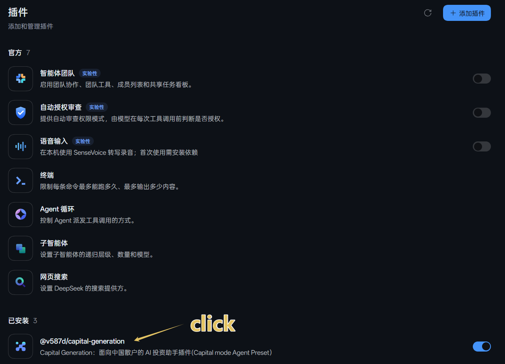
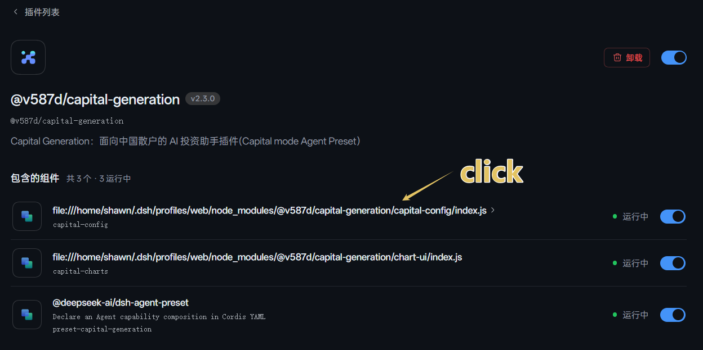
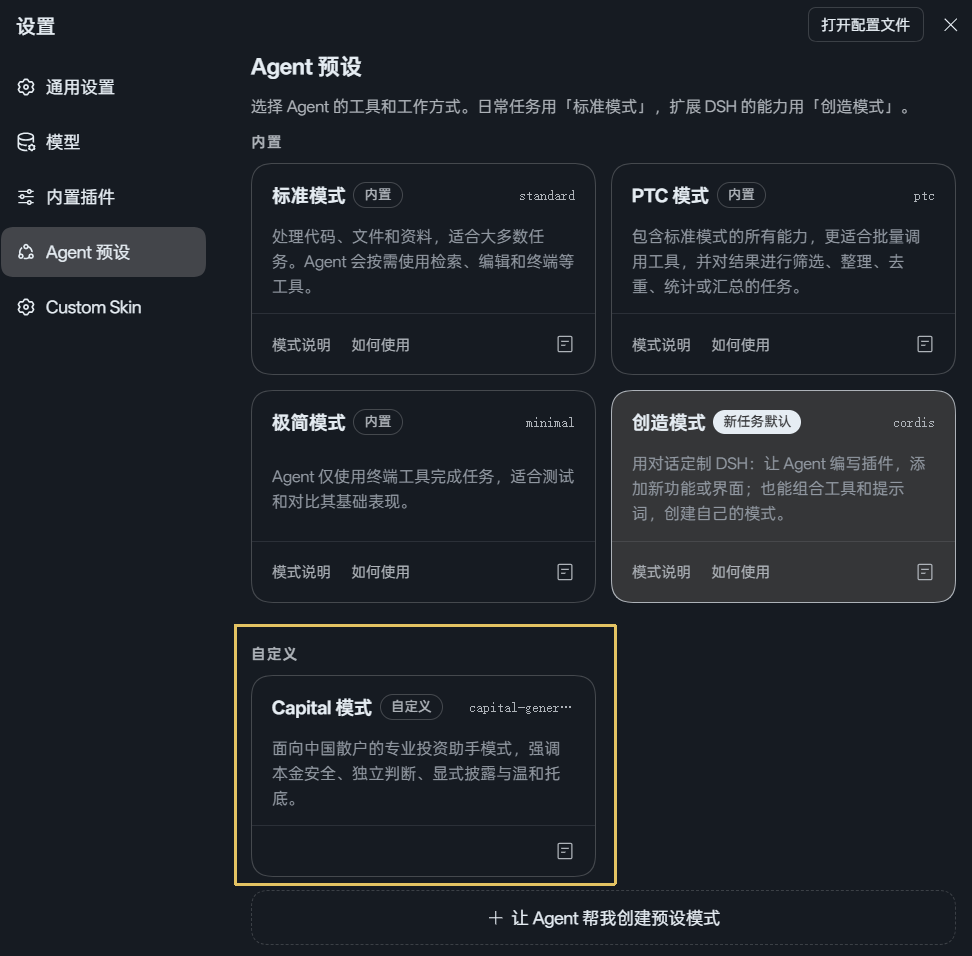
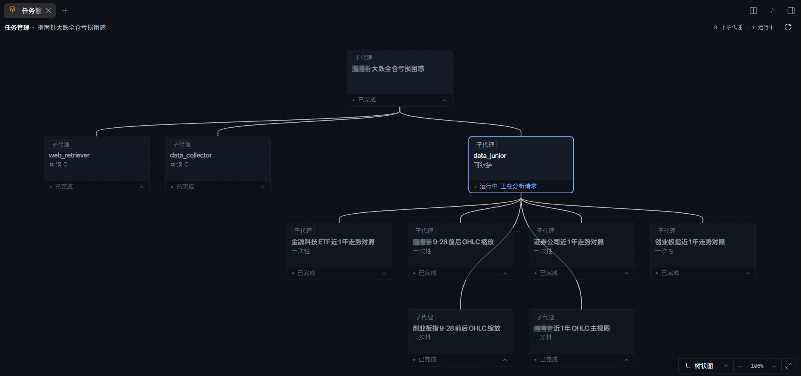
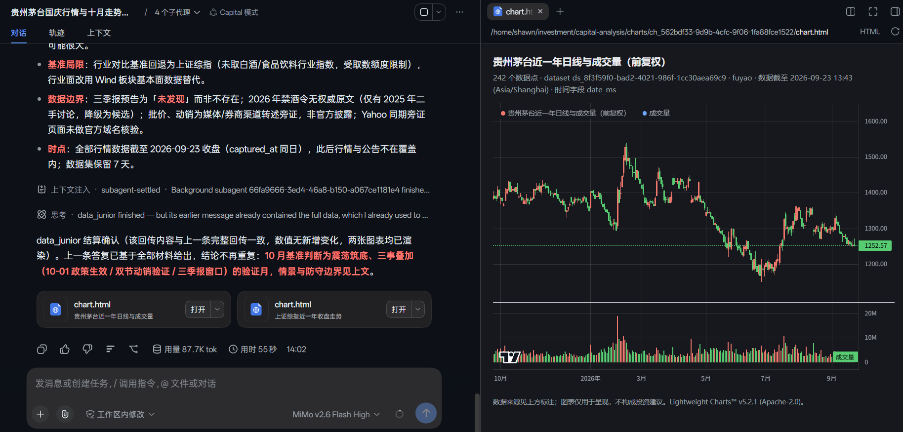
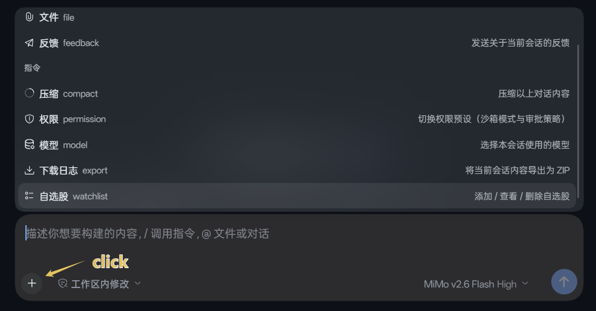

<p align="center">
  
</p>

<p align="center">
  <a href="https://github.com/v587d/capital-generation"></a>
  <a href="https://github.com/v587d/capital-generation"></a>
</p>
<p align="center">
  <a href="https://github.com/deepseek-ai"></a>
  <a href="https://github.com/deepseek-ai"></a>
  <a href="https://github.com/deepseek-ai"></a>
</p>
<p align="center">
  <a href="https://awesome-dsh-plugin.com"></a>
  <a href="LICENSE"></a>
  <a href="https://github.com/v587d/capital-generation/releases"></a>
</p>

> [!IMPORTANT]
> 本项目长期处于探索阶段，不提供任何形式的金融服务，不承诺任何投资回报。 投资需审慎， 盈亏自负，与本项目一概无关。
>
> 愿大家的财富数字就像"text generation"一样，不断增长，永不停止。

> [!NOTE]
> 先安装 [Deepseek Harness(DSH)](https://github.com/deepseek-ai/deepseek-harness) ，本项目自 2.5.0 起适配 DSH`@0.2.0-rc.2`。
> **需要 DSH ≥ 0.2.0-rc.2**：2.4.x 那一档是在 0.1.7 上验的，本版起基线抬到 0.2.0-rc.2——**Windows 桌面端携带的正是这一版**，
> 装在桌面端里要用 `0.2.0-rc.2`（`npm i -g @deepseek-ai/dsh@0.2.0-rc.2`）。再往前，0.1.5 的 settings 与 preset 挂载面已被上游删除，装在旧版上会起不来。
> 建议使用 **Deepseek/deepseek-flash**(High thinking) 搭配本项目， GPT / Claude 尚未充分测试，理论亦可。

# 💬 Slogan
Next-Gen AI-Driven Capital Generation.

## 📄 样例
[报告样例（最新）](docs/sample/指南针技术分析报告.md)

## 📑 目录

- [💬 Slogan](#-slogan)
  - [📄 样例](#-样例)
  - [📦 安装到 DSH Web Profile](#-安装到-dsh-web-profile)
- [🔍 What](#-what)
  - [🧭 多 Agent 编排（截图）](#-多-agent-编排截图)
  - [📊 data_collector 能力总表](#-data_collector-能力总表)
  - [🌐 web_retriever 能力](#-web_retriever-能力)
  - [📈 图表呈现（截图）](#-图表呈现截图)
  - [📌 自选股（用户级清单）](#-自选股用户级清单)
  - [🔧 本地开发、构建、测试](#-本地开发构建测试)
  - [📝 Changelog](#-changelog)
- [🤝 贡献](#-贡献)
- [📜 MIT](#-mit)

## 📦 安装到 DSH Web Profile

从 GitHub 安装插件（构建产物 `lib/` 已随仓库提交，**无需**克隆本项目或自行构建）：
```bash
dsh plugin --profile web add github:v587d/capital-generation
```
安装后，重启 Web profile 使装配生效。密钥填在 **「插件」页**（0.1.7 起第三方插件的可编辑面就在这里，
不在「设置」页）：已安装列表点开 `@v587d/capital-generation` → 「包含的组件」里的 `capital-config`
那一行 → 行详情页的配置段：

| ① 「插件」页 → 已安装 | ② 该 bundle 的 `capital-config` 行 | ③ 卡片：四个密钥 + 本地回退开关 |
| :---: | :---: | :---: |
| [](assets/DSH@0.1.7rc2插件设置_1.png) | [](assets/DSH@0.1.7rc2插件设置_2.png) | [](assets/DSH@0.1.7rc2插件设置_3.png) |

> [!NOTE]
> - **四把密钥都免费申请**：必填 [同花顺（fuyao）](https://fuyao.aicubes.cn/docs/)（行情、财务等结构化数据）
>   与 [AnySearch](https://www.anysearch.com/docs)（实时网络搜索）；推荐
>   [Wind Alice](https://market.windalice.com/#/home)（公告与权威新闻，每天送 300 积分）与
>   [PaddleOCR AIStudio](https://aistudio.baidu.com/paddleocr)（每天 2 万页 OCR 免费额度）。
>   除这四把之外**不再需要任何 key**：`data_collector` 的腾讯 / 东财公开能力与 `web_retriever` 的九个
>   具名来源查询工具都走公开端点，装好即可用（明细见
>   [data_collector 能力总表](docs/data-collector-capabilities.md)、
>   [web_retriever 能力](docs/web-retriever-capabilities.md)）。
> - 卡片里粘贴保存即可，**无需重启**——新开的 Capital 会话就生效。密钥值只写进 DSH 的 credentials 域
>   （配置里只存引用名，值从不随响应出网），字段旁只会显示「已配置密钥 / 未配置」。
> - 不想用卡片界面也可以直接写 `~/.dsh/.credentials.yaml`，名字用 `FUYAO_API_KEY`、`ANYSEARCH_API_KEY`、
>   `WIND_API_KEY`、`PADDLE_OCR_TOKEN`，插件会自动读取。
> - 卡片中间的 **「允许启动本地提取网页内容」** 开关（默认开启）控制抓取回退：开启时 AnySearch 抓取失败
>   会自动改由本机直连抓取该页面（回执 `via` 标注 `local-http`），关闭则失败原样回传。

### 简单用法

| 选择 Capital 模式 | 设为默认模式 |
| :---: | :---: |
| [](assets/mode_selector.png) | [](assets/DSH@_0.1.7rc2设置默认模式.png) |
| 新会话在 Agent Preset 选择器中选择 Capital 模式 | 也可以在 设置 → Agent 预设 里把 Capital 模式设为默认 |

# 🔍 What
Capital Generation 是面向中国散户，适用于日常证券研究的 DSH 插件，简单地说：

1. **Agent preset（人设）**：面向金融场景的 Capital 模式，与 DSH 默认的标准、PTC、极简、创造模式并列。

2. **多 Agent 分工，原始数据不进上下文**：所有 Agent（含主 Agent）都不直接接触原始结构数据，
   需要时由下级按需提取、提炼后回传。目前覆盖以下 Subagent（`data_analyst` 为预留角色，暂未启用）：

   | 角色 | 层级 | 一句话 |
   |---|---|---|
   | `data_collector` | 主 Agent 直属（可续接） | 收集结构化数据：**69 个 capability**（同花顺 61 + 腾讯公开 3 + 东财 5），后两类零密钥 |
   | `data_junior` | 主 Agent 直属（可续接） | 清洗、整理、基础统计与透视：读 Dataset 默认 `describe_dataset`，时间换算一律由宿主完成 |
   | `data_analyst` | 主 Agent 直属 | 用编程技能分析上游数据（**仍在开发中**，委派行 disabled） |
   | `web_retriever` | 主 Agent 直属（可续接） | 外部非结构化数据：检索 / 具名来源查询 / 文档解析，共 **14 个工具** |
   | `visualization_specialist` | `data_junior` 的 one-shot 子 Agent | 出图：只收 `profile_ref`、只回 `chart_ref`，不接触原始 rows，不直接向主 Agent 发消息 |

   逐角色职责与更多细节见 [Agent 角色与 DSH 能力复用](docs/agent-roles.md)。

3. **沿用 DSH 官方基础设施，不自行实现底层机制**：预设挂载、Subagent 编排、人设与技能注入、工作区约定、
   上下文压缩、数据持久化与用户级资产、配置与凭据、工具注册、用户交互——全部走官方扩展面，插件只带
   persona、toolFilter 与工具实现。这些通道的上游契约由 22 条探针逐条看守（`npm run check:dsh`）；
   11 条复用清单见 [Agent 角色与 DSH 能力复用](docs/agent-roles.md)。

## 🧭 多 Agent 编排（截图）

> 主 Agent 不直接碰原始结构数据：行情与财务由 `data_collector` 取，清洗与 profile 由 `data_junior` 做，
> 外部材料由 `web_retriever` 取回，出图是 `data_junior` 名下**一次性**的 `visualization_specialist`。
> 下面是 DSH 官方「任务管理」视图里的真实一轮（右下角可切树状图 / 时间轴），点击可查看原图。

| 主 Agent 与三个常驻角色 · `data_junior` 名下的一次性出图子 Agent |
| :---: |
| [](assets/agent-task-management.png) |

卡片上的「可续接 / 一次性」两种形态正好对上上面的角色表：三个直属下级是 continuable 的常驻角色
（`send_message` 可反复来回），出图那一层是 one-shot。这一轮共 9 个子代理：3 个常驻 + 6 个一次性出图。

## 📊 data_collector 能力总表

[data_collector 能力总表](docs/data-collector-capabilities.md) 列出全部 **69 个**数据 capability（元数据 / A股行情与财务 / 估值竞价 / 盘面特色 / 指数 / 基金 / 腾讯公开行情 fallback / 东方财富资金与筹码），含端点路径、主要参数（必填以 `*` 标注）、是否分页与用途，并说明**不覆盖**的模块及原因。表格由 `npm run docs:capabilities` 从 source 定义生成，测试断言「文档 == 实现」。

构成：同花顺 Fuyao **61** 个（需 `FUYAO_API_KEY`）、腾讯公开 HTTP **3** 个（`tencent_quote` / `tencent_kline` / `tencent_ticks`）、东方财富 HTTP **5** 个（龙虎榜汇总与单票、限售解禁日历、板块行情排名、板块资金流）；后两类为公开端点，**无需额外密钥**。

## 🌐 web_retriever 能力

三个工作面共 **14 个工具**，逐个的上游、参数与用途见
[web_retriever 能力](docs/web-retriever-capabilities.md)（同样由测试断言「文档 == 实现」）：

- **检索**（4）：`anysearch_search` 发现候选、`web_retriever_fetch` 按 URL 取正文（失败可按开关回退本机直连），
  `wind_docs_announcements` / `wind_docs_news`（Wind Alice）是官方公告与权威新闻的默认第一选择。
- **来源查询**（9，全部公开端点、零密钥）：财联社 / 华尔街见闻 / 东财三条 7×24 快讯互为备份，东财个股新闻
  与研报列表、新浪研报、同花顺机构一致预期 EPS、巨潮互动易（深市）、上证e互动（沪市）。
- **文档解析**（1）：`ocr`（PaddleOCR，14 个工具里唯一要 Token 的）把 PDF 研报 / 公告或图片解析成 markdown。

来源边界（深沪不可互换、北交所两边都没有）、翻页纪律（该翻页就翻到没有、空结果是真事实）
与回传格式见 [capital-web-protocol](preset/capital-generation/skills/capital-web-protocol/SKILL.md)。

## 📈 图表呈现（截图）

> 出图只有一个入口：`data_junior` 的可视化 gate → one-shot `visualization_specialist`。
> 序列数据不进模型上下文；图表由宿主以**官方** `deliverables/presented` 登记为**本轮交付物**，
> 在收尾的「本轮文件改动 / 交付」行点开即可在右侧看到可交互图表。以下均为真实会话截图，点击可查看原图。

| 侧栏自包含 HTML：折线 | 侧栏自包含 HTML：K 线 + 量价 |
| :---: | :---: |
| [](assets/chart-line-sidebar.png) | [](assets/chart-candlestick-sidebar.png) |
| 某股票近一月日成交额 | 某股票近一月日线·量价 |

| 同一窗口：左侧报告 · 右侧侧栏图表 |
| :---: |
| [](assets/left-report-right-chart.png) |

`chart.html` 自包含（内联图表库与数据），可离线打开、零外部请求；图内保留
`Lightweight Charts™ v5.2.1 (Apache-2.0)` 归属信息。

## 📌 自选股（用户级清单）

> 自选股是**宿主级的用户资产**，不是 Agent 能力：清单与报价快照存在 DSH 的存储域里、跨 workspace 通用，
> 模型工具表与 persona **零变化**（Agent 既读不到、也写不动这份清单）。出网只由用户动作触发——
> **无轮询、无自动重试**；沿用已填的同花顺（fuyao）密钥，**不新增任何 key**。

| 「指令」菜单里的入口 | 面板：搜索 / 添加 / 删除 / 刷新报价 |
| :---: | :---: |
| [](assets/instruction-watchlist.png) | [](assets/watchlist-popup.png) |
| 输入 `/`（与左下角 `+` 是同一份菜单）打开，只在 Capital 会话出现 | 默认播种四条主要沪深指数，删空不重建 |

- **搜索添加**：输证券代码（不带后缀，如 `300750`）或中文名（如 `宁德时代`）都能命中，多命中时列候选
  由用户点选；覆盖 A 股 / 指数 / ETF 三类，候选最多 10 条，清单上限 10 条。
- **每行**：名称在上，**代码 + 类型徽标（指数 / 股票 / ETF）** 在下，最新价与涨跌幅右对齐（红涨绿跌）；
  行尾一个「更多」键，展开是**「置顶」**（把这条提到第一行）与**「移除」**。删除走面板内二次确认。
- **报价**：底部是本次快照的更新时间。打开面板即刷一次（清单为空则只读本地、不出网），此后只有
  点「刷新报价」才出网，同一时刻只允许一次刷新在途。
- **报错**：位置跟着出错的那一下走，颜色只有两档——**黄 = 动作没成**（搜索失败占下拉那一行，
  替换「没有匹配的标的」；添加失败如「最多 10 条」留在输入框下方，改一个字不清它），
  **红 = 数据不可信**（整批刷新失败跟在「刷新报价」下面，单只取不到数才在价格位画红色 `—`）。
  取数失败不等于没有价：上一次成功的快照照画，只降一档色并在 tooltip 里说清是哪一刻的；
  一条都没落地的批次不推进底部那个更新时间。
- **边界**：清单落在 `~/.dsh/storages/capital_watchlist.json`（官方存储域，不在任何 workspace 目录内）；
  浏览器半边只与本机 loopback 上的宿主路由对话，且该路由接宿主的认证围栏——密钥与上游调用全在宿主侧。

## 🔧 本地开发、构建、测试

```bash
npm install
npm run build        # 生成 lib/ 与三个浏览器端产物（chart-ui、capital-config、capital-watchlist）
npm test             # 构建后运行全部测试
npm run check:dsh    # 检查上游 DSH 扩展面兼容性，升级/发布前建议跑
npm run smoke:boot   # 真实 boot graph 冒烟：装配能起、预设能解析、卡片有座位
npm run verify:sessions  # 发布前复核真实会话日志可被冷加载（需本机已装 dsh）
```

构建产物 `lib/` 已随仓库提交，普通用户从 GitHub 安装时**无需**本地构建；只有需要改插件源码或
维护子包时才需要执行以上命令。

## 📝 Changelog

### 2.5.1 — 2026-09-30

两条都是 **Windows 桌面端实机跑出来的装配失效**，`npm test` 在此之前抓不到——一条因为测试的假 ctx
认证了错的 cordis 规则，一条因为假凭据服务永远「立刻就有值」。详见 [CHANGELOG.md](CHANGELOG.md)。

- **插件页两行 异常 修好**：`capital-charts` / `capital-watchlist` 原先「先探测 `webServer`、有值就直接
  调用」，而 `ctx.get` 能解析出值**不代表**属性访问合法（cordis 的属性代理只认本层声明过 `inject`）。
  桌面端 webServer 就绪得早，于是当场抛 `cannot get property "webServer" without inject`；web 形态里它
  就绪得晚，反而躲过。现在一律走 `ctx.inject(['webServer'], …)`，两种装配顺序都对。
- **同花顺 61 颗能力不再可能整场缺席**：注册原先押在「装配期读到 `FUYAO_API_KEY`」上，而宿主的凭据服务
  是**先把服务挂出来、再去读凭据文件**——那一刻读到的就是「没有」，于是 61 颗能力整个进程静默消失且
  永不重试。现在注册不看 key，key 留到每次取数现取：缺它时报错点名 `FUYAO_API_KEY`（不再只说「未注册的
  能力」），凭据配好**同一进程就生效**，不用重启。
- **`dc_status` 不再自相矛盾**：删掉 `registration_error` 一格。它此前会和 `api_key.present=true` 同时
  出现在一份回执里，把人引向「是不是我 key 配错了」。

从 2.5.0 升级**无需迁移**：工具入参、数据能力、设置卡片、会话日志格式都没变，宿主仍要求
`0.2.0-rc.2`（不新增要求）。**更早版本的变更历史见 [CHANGELOG.md](CHANGELOG.md)**，GitHub Release
说明也从这里对应段落复制。

# 🤝 贡献
可自行克隆本项目，按上方「本地开发、构建、测试」执行。
由于本项目正在迭代中，具体贡献规则见[CONTRIBUTING](CONTRIBUTING.md)，提 PR 前建议 rebase.
欢迎提 issue 和 PR.

[DSH 官方社区](https://github.com/deepseek-ai/deepseek-harness/discussions/6947)

[Capital Generation 项目社区](https://github.com/v587d/capital-generation/discussions)

# 📜 MIT
